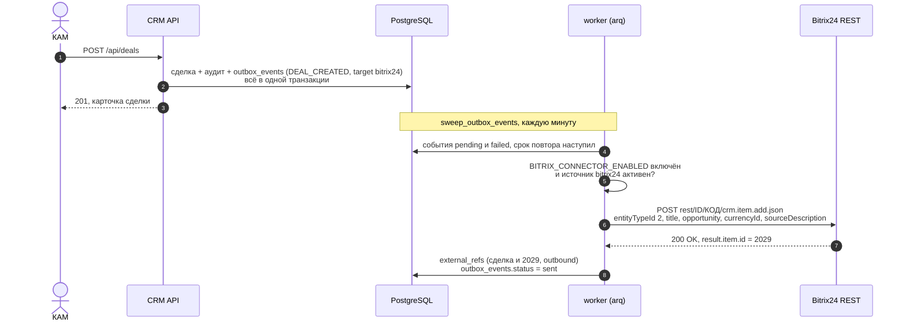
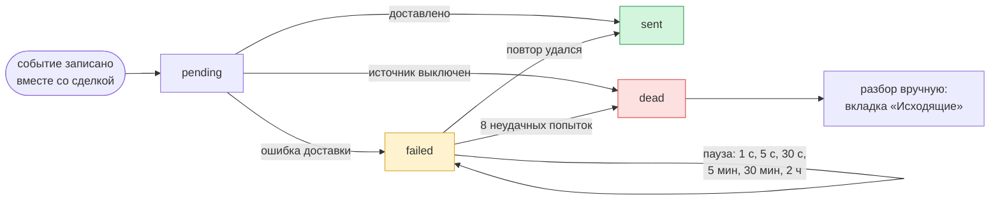
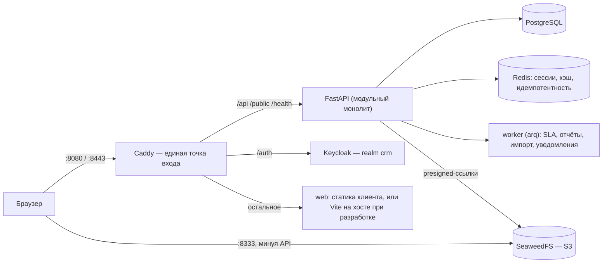

<div align="center">

# RTK School CRM

**Внутренняя CRM ИТ Школы Ростелекома для продаж образовательных программ вузам и физлицам — воронки с SLA, автоподстановка организаций по ИНН, электронная подпись ПЭП и неизменяемый аудит в закрытом контуре**

<sub>Разработано командой **«Тесткит»** — [github.com/lct-testkit](https://github.com/lct-testkit). Это README продукта целиком; короткий гид по репозиториям — на [странице организации](https://github.com/lct-testkit).</sub>

<!--STATS-->
**47** экранов &nbsp;·&nbsp; **165** из **181** ручек API связаны с экранами &nbsp;·&nbsp; **66** блоков интерфейса &nbsp;·&nbsp; **232** теста клиента &nbsp;·&nbsp; **4** роли &nbsp;·&nbsp; **4** темы &nbsp;·&nbsp; блоки **B1–B15** (приняты)
<!--/STATS-->

[Быстрый старт](#быстрый-старт) · [Сценарии по ролям](#сценарии-по-ролям) · [Как устроено](#как-устроено) · [Битрикс24](#интеграция-с-битрикс24) · [Соответствие требованиям кейса](#соответствие-требованиям-кейса) · [Библиотеки](#используемые-библиотеки) · [Проверка качества](#проверка-качества) · [Веб-клиент](https://github.com/lct-testkit/frontend#readme) · [Бэкенд](https://github.com/lct-testkit/backend#readme) · [Дизайн-система](https://github.com/lct-testkit/rt-ui#readme)

|  |  |
|:-:|:-:|
| *Сделки — таблица, вкладки, фильтры, роль КАМ* | *карточка сделки — лента шагов, вкладки, тёмная тема* |

<sub>Экраны собраны из блоков `frontend/src/lib/ui` на дизайн-системе Ростелекома rt-ui. Демо поднимается одной командой Docker Compose плюс dev-клиент; порты, учётки и устранение неполадок — ниже.</sub>

</div>

ИТ Школа Ростелекома продаёт образовательные программы вузам и колледжам (B2B) и физическим лицам (B2C); до внедрения этой системы путь от первого контакта с вузом до запуска обучения вёлся вручную и нигде не был виден целиком. RTK School CRM ведёт этот путь как сделку в настраиваемой воронке статусов со сроками (SLA) и эскалациями, распознаёт организацию по ИНН через локальный реестр ЕГРЮЛ, принимает каталоги вузов и продуктов из xlsx/xls/csv, считает отчёты и дашборды, подписывает документы простой электронной подписью (ПЭП) и пишет каждое действие в неизменяемый аудит-журнал с цепочкой хэшей — всё это по 152-ФЗ и в закрытом контуре без интернета в рантайме. Исходное задание хакатона — `rtk_requiriments.md` (выдано организаторами, в репозиториях не хранится); внутренний паспорт и техническое задание, написанные по нему командой «Тесткит», — [`new_spec.md`](docs/new_spec.md) и [`dop.md`](docs/dop.md) (дополнения про ПЭП, ЕГРЮЛ и дизайн-систему).

## Почему это интересно

* **Воронка — не код, а данные.** Статусы, переходы, условия (guard), обязательные поля и SLA собираются в редакторе графа (`@xyflow/svelte`) и публикуются без единой правки кода; сиды разворачивают ровно 14-шаговую B2B-воронку и 6-шаговую B2C из технического задания.
* **Организация находится по одному полю.** «ИНН или название» ищет в локальном реестре ЕГРЮЛ (офлайн, без внешней сети), предлагает совпадения с пометкой ликвидированных, находит дубли и расхождения реквизитов с реестром — раньше на этот шаг уходили часы переписки.
* **Подпись юридически значима, а не чекбокс.** Простая электронная подпись (ПЭП) — код по независимому каналу, протокол, хэш и QR на штампе документа; публичная страница `/verify` сверяет подпись по номеру или по файлу.
* **Аудит нельзя переписать.** Каждое изменяющее действие попадает в `audit_log` с цепочкой хэшей; ролью `crm_app` в базе разрешены только `SELECT`/`INSERT`, `UPDATE`/`DELETE` запрещены на уровне `GRANT` — это проверяет отдельная роль аудитора и сценарий `c-audit`.
* **Один клиент, два режима без пересборки.** Demo (выбор роли в один клик) и prod (только Keycloak, серверная сессия) переключаются переменной окружения образа `web`; собранный бандл один и тот же.
* **Права видны на трёх уровнях.** Маршрут и право, объект, SQL-фильтр списка — даже если проверку объекта забыли на одном уровне, запрос не должен вернуть чужие данные; в интерфейсе то же право (`/api/me → scopes`) решает, что показать в меню.
* **Телефон — не уменьшенный десктоп.** Таблицы становятся карточками, поля увеличиваются до 48 px, нажимаемые цели — от 44 px; проверяется отдельным инструментом (`taps.mjs`), а не на глаз.
* **Дизайн-система везде, где она что-то умеет.** Кнопки, поля, таблица, окна, вкладки — компоненты `rt-ui` (порт дизайн-системы Ростелекома на Svelte 5); своё — только раскладка и то, чего в библиотеке нет.

## Как это выглядит

|  |  |
|:-:|:-:|
| *Главная КАМ: KPI, что требует внимания, задачи* | *Сделки доской по статусам воронки* |

|  |  |
|:-:|:-:|
| *новая организация: автоподстановка по ИНН* | *редактор воронки: граф статусов, администратор* |

|  |  |
|:-:|:-:|
| *подписание: входящие и просмотр документа* | *отчёты и дашборд с графиками* |

|  |  |
|:-:|:-:|
| *журнал аудита: проверка цепочки хэшей* | *мастер импорта: сопоставление колонок* |


*Одни и те же «Сделки» в четырёх темах (Rostelecom и Purple × светлая и тёмная); тема — один CSS-класс.*

## Редактор воронки: графовый конструктор

Кейс прямо разрешает «креатив» в конструкторе workflow (`new_spec.md §4.11`) — вместо жёстко зашитых 14 шагов воронка целиком редактируется графом: узлы и рёбра, без единой правки кода. Это не просто картинка статусов — за каждым узлом и ребром стоит реальное поведение бэкенда.


*Тот же конструктор на короткой демо-воронке (4 статуса) — виден весь холст сразу: сеть переходов между «Успех», «Отказ» и «Пауза» пунктиром, автораскладка слева направо.*

* **Узел — статус.** Код (`^[a-z][a-z0-9_]{1,63}$`, неизменяем после создания — на него ссылаются данные), название (правится в любой момент, даже у опубликованного статуса), тип — `initial` (один на воронку) / `intermediate` / `won` / `lost` / `parked` (заморозка: таймер SLA на паузе), цвет, обязательные поля сделки для входа в статус. `StatusDraft`, `frontend/src/lib/features/config/workflows/graph.ts`.
* **Ребро — переход.** Кто может нажать (роли `KAM`/`HEAD`/`ADMIN`/`AUDITOR`/`INTEGRATION`), нужен ли обязательный комментарий, условия-guard и действия по факту перехода.
* **Условия (guard) — небольшой DSL, не строка кода.** Дерево `all`/`any` глубиной до 5 и до 50 листьев; лист — поле сделки (в т. ч. `custom_fields.*`), оператор (`equals`, `не равно`, `>`, `>=`, `<`, `<=`, `заполнено`, `не заполнено`, `одно из`, `ни одно из`, `содержит`, `есть`, `раньше даты`, `позже даты`) и значение. Переход, которому чего-то не хватает, в карточке сделки становится чек-листом со ссылками «Заполнить» — не текстом ошибки. `frontend/src/lib/features/config/workflows/dsl.ts`.
* **Действия перехода.** Создать задачу, отправить уведомление, запросить подпись (`request_signature` — переход сам открывает вкладку «Подписание» в карточке), событие интеграции.
* **SLA на узле, не глобально.** Срок в часах, порог предупреждения в процентах, эскалация на роль или конкретного человека, каналы уведомления, счёт только по рабочим дням; при переходе — пересчитать срок заново / сохранить накопленное время / сбросить таймер (`SlaDraft`).
* **Валидация — до сохранения, не после.** Клиентское зеркало серверных правил проверяет на лету: ровно один начальный статус, всё достижимо из него (без «ловушек» — узлов без исходящих рёбер), есть хотя бы один терминальный статус, условия ссылаются на существующие поля. Кнопка «Проверить» и публикация зовут ту же проверку на сервере (это пишет запись аудита — поэтому не на каждое изменение графа).
* **Черновик → публикация.** Правки в графе — черновик; ничего не действует, пока не нажали «Опубликовать» (версия графа — хэш, виден в панели свойств). Можно попробовать и откатиться, не боясь сломать текущие сделки.
* **Удаление статуса с живыми сделками — не потеря данных.** Мастер сопоставления: целевой статус (и резервный), предпросмотр — сколько сделок и в каком SLA-режиме заденет, фоновая задача переноса, сам статус становится архивным (не удаляется — на него ссылается история).
* **Автораскладка и минимап.** Кнопка «Расставить автоматически» — BFS-обход от начального статуса слева направо, столбец на уровень; узлы можно перетаскивать руками, позиции запоминаются в `localStorage` по воронке (бэкенд координаты не хранит — это только вид, не данные); минимап — на десктопе.
* **Открытый холст, не самописный canvas.** `@xyflow/svelte` (открытая библиотека графов, в зависимостях клиента отдельно от дизайн-системы) — своей отрисовки узлов, рёбер, зума и панорамирования с нуля не писали; своё в холсте — только стиль узла/ребра под дизайн-систему и автораскладка.

Готовые воронки — `b2b_university_v1` (14 шагов, ровно список из раздела 2 `rtk_requiriments.md`) и `b2c_individual_v1` (6 шагов, авторское дополнение под физлиц), обе публикуются сидом бэкенда (`backend/app/modules/workflow/seed.py`). Экран — `/workflows/{id}`, код — `frontend/src/lib/features/config/workflows/editor/` (`CanvasFlow.svelte` — холст, `StatusNode.svelte`/`TransitionEdge.svelte` — узел и ребро, `StatusPanel.svelte`/`TransitionPanel.svelte` — панель свойств, `ArchiveWizard.svelte` — мастер сопоставления, `PublishDialog.svelte` — публикация).

## Интеграция с Битрикс24

В `new_spec.md` (§4.14) это «козырь»: создаём сделку у нас — она появляется в Битриксе. Ниже не описание намерений, а **один реальный прогон на живом корпоративном портале 25.09.2026**: от кнопки «Создать сделку» до карточки в Битриксе, с логами, записями БД и записью аудита, которые показывают, что отправила именно система. Секреты на скриншотах замазаны.



* **Очередь событий (outbox), а не прямой вызов из запроса.** Событие `DEAL_CREATED` пишется в `outbox_events` в той же транзакции, что сделка и запись аудита — у этих двух строк одинаковое `created_at` до микросекунды (`now()` в PostgreSQL — время начала транзакции, видно на скриншотах ниже). Сделка не пропадёт, если Битрикс недоступен, а недоступный Битрикс не тормозит КАМа: ответ `201` уходит сразу. Воркер (`arq`, `sweep_outbox_events`, `backend/app/modules/integration/tasks.py`) разбирает очередь раз в минуту.
* **Канал — входящий вебхук Битрикса** (`https://{портал}/rest/{user_id}/{код}/`), методы `crm.item.add` / `crm.item.update` / `crm.item.get` с `entityTypeId=2` (сделка). Старые `crm.deal.*` в документации Битрикса помечены остановленными — не используются. Секрет — сам URL: в БД лежит только **имя** переменной окружения (`BITRIX_WEBHOOK_URL`), значение — в `.env`, в логи оно не попадает (см. «Что нашли по дороге»). Код — `backend/app/modules/integration/bitrix.py`.
* **Что уходит:** `title`, `opportunity` (сумма), `currencyId`, `sourceId` (`OTHER`) и `sourceDescription` — `CRM #<номер сделки>`: по нему сделку в Битриксе видно и в обратную сторону.
* **Связь сделок** — таблица `external_refs`: id у нас ↔ id в Битриксе, версия, направление. По ней следующие изменения уходят как `crm.item.update`, а не создают дубль.
* **Сбой доставки — не потеря.** Повторы с паузой 1 с, 5 с, 30 с, 5 мин, 30 мин, 2 ч; после 8-й неудачи событие становится `dead` и ждёт ручного разбора на вкладке «Исходящие» экрана интеграций.
* **Конфликты.** Перед `crm.item.update` читаем `crm.item.get` и сравниваем `updatedTime` с нашей последней синхронизацией: если сделку в Битриксе правили после неё, мы её не затираем — доставка падает с ошибкой «требует ручного разбора» и идёт по тому же циклу повторов.



### Как включить

Нужны все три условия:

1. В `backend/.env`: `BITRIX_CONNECTOR_ENABLED=true` и `BITRIX_WEBHOOK_URL=https://<портал>/rest/<id>/<код>`, затем `docker compose up -d api worker`. Вебхук создаётся в самом Битриксе: «Разработчикам» → «Другое» → «Входящий вебхук», права — только **CRM**.
2. В CRM под администратором: «Настройка» → «Интеграции» → «Источники» → переключатель «Bitrix24». Пока он выключен, события уходят в `dead` со `source_inactive`. Флаг функции `bitrix_connector` на экране «Настройки» доставку не меняет — он справочный.
3. Тестируйте одной сделкой с очевидным названием. Удаление в Битрикс не синхронизируется — тестовую сделку там удаляют руками; после проверки источник выключают, а вебхук отзывают.

### Прогон на живом портале, 25.09.2026

|  |  |
|:-:|:-:|
| *1. Администратор включает источник «Bitrix24» — чип «Активен»* | *2. КАМ создаёт сделку «ТЕСТ Тесткит — удалить», 1 000 ₽* |
|  |  |
| *3. Сделка создана — `D-2026-000081`, 13:33 МСК* | *4. Через ~45 с в «Исходящих» — «Отправлено». Ниже старые «Не доставлено / source_inactive» с 21.09, когда источник был выключен* |
|  |  |
| *5. «Связи»: наша сделка ↔ Bitrix24 `2029`* | *6. В Битриксе — сделка 2029: название, сумма, «Дополнительно об источнике: CRM #D-2026-000081»* |
|  |  |
| *7. Канбан воронки, колонка «Новая» (остальное скрыто — там данные клиентов компании)* | *8. Сработала автоматизация самого портала — уведомление «Создана новая сделка 2029»* |

### Что показывает, что отправила именно система

Не ручное создание в Битриксе и не скриншот-«рисунок»: у каждой строки ниже свой источник — команда, которой она получена, видна в шапке скриншота.


*Воркер: цикл `sweep_outbox_events`, исходящий `POST …/crm.item.add.json` и ответ `200 OK`, итог `{'sent': 1, …}`. Портал и код вебхука замазаны. Строка `httpx` — из версии до исправления утечки секрета (ниже): сейчас такие строки в лог не пишутся.*


*БД: событие `DEAL_CREATED` → `bitrix24` со статусом `sent` (создано 10:33:14, отправлено 10:34:00 UTC), попыток 0, ошибок нет; в `external_refs` — `external_id = 2029`. Это id, который вернул Битрикс: узнать его иначе, чем вызвав API, было нельзя.*


*Трасса одного запроса: один и тот же `X-Request-Id` в access-логе Caddy, в логе API (`201`, 87 мс) и в записи журнала аудита `DEAL_CREATED` с цепочкой хэшей (`prev_hash` → `hash`).*


*Тот же запрос в интерфейсе журнала аудита: слева хронология — 13:26 флаг функции, 13:29 источник интеграции, 13:33 сделка; справа запись с тем же идентификатором запроса и хэшем.*

### Чего нет — честно

* **Битрикс → CRM реальными событиями.** Наш `POST /api/v1/integrations/bitrix/webhook` принимает упрощённый собственный контракт с HMAC-подписью; настоящий исходящий вебхук Битрикса шлёт другой формат и подписи не даёт. Настоящая подписка на события (`event.bind`) требует зарегистрированного локального приложения на портале и публичного адреса стенда — здесь не поднята, честно описано в `integration/bitrix.py`.
* **Стадия, воронка, ответственный, компания, контакт, удаление не синхронизируются.** Это идентификаторы на стороне портала, надёжной таблицы соответствия нет. Новая сделка попадает в воронку по умолчанию на первую стадию.
* **`sourceId` зашит как `OTHER`.** В справочнике источников этого портала такого кода нет, поэтому поле «Источник» в Битриксе пустое («Не выбран»), а текст источника лежит в «Дополнительно об источнике». Код источника стоит брать из настроек портала.
* **Автоматизация портала срабатывает** (роботы, уведомления) — на боевом портале это видят живые люди.

### Что нашли по дороге

* **Секрет вебхука попадал в логи воркера.** `httpx` на уровне INFO пишет каждый исходящий запрос с полным URL, а у Битрикса секрет — сам URL. Исправлено 25.09.2026: `backend/app/core/logging.py` (`httpx` и `httpcore` на WARNING), тест `backend/tests/test_logging.py`, записи `frontend/docs/backend-issues.md` №38.
* **Флаг функции `bitrix_connector` — ловушка интерфейса.** Он выглядит как главный выключатель, но код его не читает; доставку решают переменная окружения и переключатель источника.

## Требования

| Что | Требование | Основание |
|---|---|---|
| Docker | Docker Desktop с Compose v2 (`docker compose`); интернет нужен при сборке образов, в рантайме — нет | версии на машине разработчика: Docker 29.8.0, Compose v5.5.1 |
| Node.js и pnpm | Node — по `engines` зависимостей клиента (`engine-strict=true` в `.npmrc`): 20.19+, 22.13+ или 24+; pnpm 11.13.1 (`npm install -g pnpm@11.13.1`) | образ клиента собирается на `node:22-alpine`; на машине разработчика — Node v26.1.0 |
| Chrome или Edge | только для инструментов проверки (Playwright; Edge — `PW_CHANNEL=msedge`) | `frontend/tools/lib.mjs` |
| Доступ к пакету и шрифт | токен чтения приватного пакета `@lct-testkit/rt-ui` из GitHub Packages (classic PAT со scope `read:packages`; нужен для `pnpm install` и сборки образа), `frontend/static/fonts/*.woff` (не обязателен — есть запасная гарнитура; шрифт выдаёт заказчик) | [`frontend/README.md`](https://github.com/lct-testkit/frontend#быстрый-старт), `frontend/Dockerfile` |
| Порты | 8080, 8443, 8333, 5433 (стек); 5273 (dev-клиент); 4273 (`pnpm preview`) — свободны на хосте; 5173 занят другим проектом, не трогать | `backend/docker-compose.yml`, `frontend/package.json` |

## Быстрый старт

Есть два способа поднять систему: **демо-версия** (для разработки и показа — dev-клиент с HMR за Docker-бэкендом) и **полноценная версия** (собранный образ клиента, единый origin, вход только через Keycloak).

### Демо-версия

Бэкенд поднимается в Docker, клиент — из исходников (`pnpm dev`), вход — выбором роли в один клик. Нужны Docker Desktop, Node.js и pnpm, а также токен чтения пакета `@lct-testkit/rt-ui` из GitHub Packages ([как его настроить](https://github.com/lct-testkit/frontend#быстрый-старт)) и (не обязательно) шрифт `frontend/static/fonts/*.woff`.

```bash
cd backend
cp .env.example .env
docker compose up -d --build
```

Поднимутся `postgres`, `redis`, `seaweedfs`, `keycloak`, `ntp`, `sms-gateway-mock`, разовые `migrate` и `seed` (две демо-воронки), затем `api`, `worker` и `caddy`; на чистой машине — около минуты, дольше всего стартует Keycloak.

```bash
docker compose ps
```

```bash
curl http://localhost:8080/health/ready
```

Ожидается `{"status":"ok", ...}` со всеми зависимостями `ok: true`. Затем клиент:

```bash
cd ../frontend
pnpm install
pnpm dev
```

Откройте http://localhost:5273 — экран «Выберите роль». При первом входе примите согласие на обработку персональных данных. Чтобы в «Отчётах» появились шаблоны, а у интеграций и уведомлений — заготовки, один раз выполните три сида (идемпотентны):

```bash
docker compose exec api python -m app.modules.reporting.seed
```

Полное наполнение демо-данными (организации, сделки, реестр ЕГРЮЛ) — `node tools/seed-demo.mjs` из `frontend`, подробности в разделе [«Демо-данные»](#демо-данные).

### Полноценная версия

Клиент собирается в образ `web` и работает за тем же Caddy, что API и Keycloak: один адрес, серверная сессия вместо токенов в браузере, вход только через Keycloak (кнопка «Войти», без выбора роли).

```bash
cd frontend
docker build -t rtk-crm-web .
```

```bash
cd ../backend
docker compose --profile web up -d --build
```

Клиент открывается на http://localhost:8080. Режим `demo`/`prod` задаёт переменная `APP_MODE` сервиса `web` в `backend/.env`; переключение — `docker compose --profile web up -d web` (пересобирать образ не нужно). Профиль бэкенда (`APP_PROFILE`: `dev`/`demo`/`prod`) переключается отдельно и решает, разрешён ли вход по `Authorization: Bearer` — в `prod` он ограничен ролью `INTEGRATION`, поэтому demo-режим клиента работает только на профилях `dev` и `demo`. Подробный разбор переменных окружения, вход по OIDC шаг за шагом и способ открыть dev-клиент через Caddy для проверки prod-входа при разработке — [`frontend/README.md`](https://github.com/lct-testkit/frontend#один-origin-с-api-dev-клиент-за-caddy).

## Демо-данные

После чистого запуска контейнер `seed` создаёт только две опубликованные воронки — организаций, контактов и сделок нет. Наполняет их скрипт клиента, который ходит в API под демо-учётками:

```bash
cd frontend
node tools/seed-demo.mjs
```

Создаёт команду «Отдел вузов»; справочники (5 причин отказа, 4 продукта — если их ещё нет); выгрузку реестра ЕГРЮЛ на 28 организаций для автоподстановки по ИНН (часть — ликвидирована или в процессе реорганизации, специально для проверки этих состояний); SLA-правила воронок с короткими сроками на ранних статусах, чтобы демо сразу показывало «истекает» и «нарушено»; 14 организаций, 15 контактов и 9 частных лиц; до 39 сделок B2B и B2C, доведённых по графу воронки до разных статусов, с комментариями, задачами и участниками. Скрипт идемпотентен: организации ищутся по ИНН, контакты — по фамилии в организации, сделки — по названию; повторный запуск ничего не дублирует. Побочный эффект: принимает согласие на обработку ПДн у демо-учёток. Через Caddy вместо dev-сервера: `APP_URL=http://localhost:8080 node tools/seed-demo.mjs`. Для экранов «Удаление ПДн» и «Согласования» (два администратора проходят «четыре глаза») — отдельно, тоже идемпотентно: `node tools/scenarios/lead-seed-erasure.mjs`.

Сбросить всё до состояния сразу после установки (удаляет ВСЕ данные проекта — БД PostgreSQL вместе с Keycloak, файлы SeaweedFS, Redis; realm `crm` заново импортируется только при создании БД Keycloak):

```bash
cd backend
docker compose down -v
docker compose up -d --build
```

## Карта репозиториев

Проект живёт в пяти репозиториях организации [`lct-testkit`](https://github.com/lct-testkit):

| Репозиторий | Что внутри |
|---|---|
| [`backend`](https://github.com/lct-testkit/backend) | API (модульный монолит), `docker-compose.yml` всего стека — см. [README](https://github.com/lct-testkit/backend#readme) |
| [`frontend`](https://github.com/lct-testkit/frontend) | веб-клиент (SvelteKit), `tools/` проверок, `docs/` — см. [README](https://github.com/lct-testkit/frontend#readme) |
| [`rt-ui`](https://github.com/lct-testkit/rt-ui) | исходники дизайн-системы Ростелекома (порт на Svelte) — см. [README](https://github.com/lct-testkit/rt-ui#readme) |
| [`deploy`](https://github.com/lct-testkit/deploy) | манифест образов, CI/CD, прод-профиль compose, Helm-чарт, автодеплой, офлайн-бандл, заглушки LMS/CMS — см. [README](https://github.com/lct-testkit/deploy#readme) |
| [`.github`](https://github.com/lct-testkit/.github) | этот файл; `docs/` — паспорт проекта и ТЗ команды (`new_spec.md`, `dop.md`); `architecture/` — архитектура в Archi (Open Exchange), функциональный и компонентный вид, 3 слоя; `profile/` — страница организации |

Команды в этом README (`cd backend`, `cd ../frontend`) рассчитаны на раскладку «репозитории рядом в одной папке»:

```text
testkit-lct/
├── backend/
├── frontend/
├── rt-ui/
├── deploy/
└── .github/
```

Для локальной разработки и демо — боевой compose-файл `backend/docker-compose.yml` (см. «Быстрый старт» выше). Для реального сервера и Kubernetes — репозиторий `deploy`: `images.yaml` (единый манифест образов, GHCR), прод-профиль `compose/` (готовые образы вместо локальной сборки), Helm-чарт `charts/rtk-crm/`, автодеплой на VM, офлайн-поставка релизом GitHub — подробности и пошаговые инструкции в [`deploy/RUNBOOK.md`](https://github.com/lct-testkit/deploy/blob/main/RUNBOOK.md).

## Адреса, порты и учётные записи

| Адрес | Что это |
|---|---|
| http://localhost:5273 | dev-клиент (`pnpm dev`), demo-режим |
| http://localhost:8080 | Caddy: клиент (образ `web` или Vite через `WEB_UPSTREAM`), API, Keycloak |
| https://localhost:8443 | то же по TLS (`tls internal`, самоподписанный сертификат — браузер честно предупредит, это ожидаемо) |
| http://localhost:8080/api/docs | Swagger UI (закрыт при `APP_PROFILE=prod`) |
| http://localhost:8080/api/openapi.json | контракт OpenAPI, 181 операция |
| http://localhost:8080/health/live, `/health/ready` | живость; готовность (БД, Redis, JWKS Keycloak, SeaweedFS, очередь) |
| http://localhost:8080/auth, `/auth/admin` | Keycloak, realm `crm`; учётные данные консоли — в `backend/.env.example` (`KEYCLOAK_ADMIN_*`) |
| http://localhost:8333 | вход Caddy в SeaweedFS для presigned-ссылок (файлы) |
| localhost:5433 | PostgreSQL для pgAdmin: база `crm`; пользователь и пароль — в `backend/.env.example` (`POSTGRES_*`) |

Порт 5173 (стандартный для Vite) на машине разработчика занят другим проектом — клиент поэтому работает на 5273; не занимайте и не освобождайте его этой задачей.

**Демо-учётки (только для демо).** Создаются при импорте realm `crm` (`backend/deploy/keycloak/realm-crm.json`), те же значения — в `frontend/static/config.json` и `backend/README.md`. В демо-режиме клиента вход — выбором роли в один клик, пароль вводить не нужно; сами пароли демо-учёток здесь не публикуются, они лежат в этих файлах приватных репозиториев.

| Логин | Роль | Что видит |
|---|---|---|
| `kam.ivanov` («Иван Тесткитович») | KAM (менеджер по вузам) | свои сделки, организации, подписи |
| `head.petrov` | HEAD (руководитель) | сделки команды, импорт, переназначение |
| `admin.crm` | ADMIN | воронки, пользователи, справочники, интеграции |
| `admin.volkov` | ADMIN (второй) | нужен для подтверждения «четыре глаза» |
| `auditor.smirnov` | AUDITOR | журнал аудита |

## Сценарии по ролям

| Роль | Куда попадает после входа | Что делает |
|---|---|---|
| **КАМ** (менеджер по вузам) | Главная (KPI, что требует внимания) | Ведёт свои сделки по воронке, заводит организации и контакты, отправляет на подпись, читает отчёты по себе |
| **Руководитель** (HEAD) | Главная (по команде) | Всё, что КАМ, плюс сделки команды, массовая передача ответственного, запуск импорта, согласования, отчёты по команде, аудит по команде |
| **Администратор** (два — «четыре глаза») | Главная | Всё, плюс воронки, справочники, пользователи, интеграции, реестр ЕГРЮЛ, соглашения ЭДО, удаление ПДн; критичные действия (создание ADMIN, удаление ПДн) подтверждает второй администратор |
| **Аудитор** | Журнал аудита | Только чтение: журнал, экспорт, проверка цепочки хэшей; к сделкам и организациям доступа нет |
| **Внешний подписант** (представитель вуза, физлицо) | `/sign/{token}` без входа | Просматривает один документ и подписывает его кодом по независимому каналу |
| **Приглашённый сотрудник** | `/invite/{token}` | Задаёт пароль по ссылке → принимает согласие на ПДн → входит |

Подробные пользовательские потоки (экраны, блоки, обязательные состояния для каждого) — [`frontend/docs/USERFLOWS.md`](https://github.com/lct-testkit/frontend/blob/main/docs/USERFLOWS.md); соответствие меню правам — [`frontend/src/lib/nav.ts`](https://github.com/lct-testkit/frontend/blob/main/src/lib/nav.ts).

## Как устроено



`/auth/*` проксируется без среза префикса (Keycloak сам работает под `/auth`); `/metrics` наружу отдаёт 404. Бэкенд сам является BFF: при входе через Keycloak токены остаются в Redis, браузер получает только httpOnly-cookie. Полная схема с переменными окружения — [`backend/README.md`](https://github.com/lct-testkit/backend#readme), архитектура клиента — [`frontend/README.md`](https://github.com/lct-testkit/frontend#как-устроено).

### Профили бэкенда

`APP_PROFILE` (`backend/app/core/config.py`) переключает поведение независимо от режима клиента:

| Профиль | Cookie сессии | Bearer-вход | Swagger UI | CORS |
|---|---|---|---|---|
| `dev` | без `Secure` | разрешён всем ролям | открыт | `localhost:5173`, `localhost:3000` |
| `demo` | с `Secure` | разрешён всем ролям | открыт | выключен |
| `prod` | с `Secure` | только роль `INTEGRATION` | закрыт (схема доступна) | выключен |

Демо-режим клиента (пароль-грант в браузере) работает только на профилях `dev` и `demo` — в `prod` прямой вход по Bearer для человека запрещён, поэтому клиент обязан входить через серверную сессию.

## Что внутри

| Категория | Backend-модуль (`backend/app/modules`) | Клиент (`frontend/src/lib/features`) | Экраны |
|---|---|---|---|
| Сделки и воронка | `crm`, `workflow` | `crm/deals`, `config/workflows` | `/deals`, `/deals/[id]`, `/workflows[/id]` |
| Организации, контакты, ЕГРЮЛ | `catalog`, `registry` | `crm/organizations`, `crm/contacts`, `config/registry` | `/organizations[/id]`, `/contacts[/id]`, `/admin/registry` |
| Справочники | `catalog` | `config/catalog` | `/catalog/*` (продукты, направления, причины отказа, праздники, поля, регионы) |
| Импорт каталогов | `imports` | `config/imports` | `/imports`, `/imports/new`, `/imports/[id]` |
| Отчёты и дашборды | `reporting` | `config/reports` | `/reports`, `/reports/history`, `/reports/dashboards[/id]` |
| Подписание (ПЭП) | `signing` | `signing` | `/signing[/id]`, `/signing/requests/[id]`, `/sign/[token]`, `/verify` |
| Пользователи и доступы | `identity`, `admin` | `identity` | `/admin/users[/id]`, `/admin/teams`, `/admin/approvals`, `/admin/erasure[/id]` |
| Аудит | `audit` | `identity/audit` | `/admin/audit` |
| Интеграции | `integration` | `config/integrations` | `/admin/integrations` |
| Уведомления | `notification` | `crm/notifications` | `/notifications`, `/notifications/settings` |
| Файлы | `files` | `lib/api/upload.ts` | сквозной: вложения сделок, импорт, сканы ЭДО |

## Соответствие требованиям кейса

Таблица — по `rtk_requiriments.md` (раздел 4 и далее); только то, что подтверждено кодом или конфигурацией.

| Требование кейса | Где в продукте |
|---|---|
| Каталоги ИТ-продуктов, направлений, вузов и ответственных в БД, актуализация загрузкой xls/xlsx по маппингу полей | `backend/app/modules/catalog` (справочники) + `backend/app/modules/imports` (мастер: файл → профиль → маппинг колонок → dry-run → применение → откат), `frontend/src/lib/features/config/imports`. Набор полей — модель CRM (организация/продукт/направление), а не буквальный список полей кейса (вендор, номер договора и т.п. в явном виде не заведены как отдельные колонки) |
| Отчёты по всем взаимодействиям за период, фильтры по вузам/направлениям/продуктам/ответственным | `backend/app/modules/reporting` (8 шаблонов: воронка, сводка по КАМам, регионы, причины отказа, SLA, динамика по месяцам, зависшие сделки), фильтры сделок по организации, направлению, продукту, ответственному и периоду — `frontend/src/lib/features/crm/deals/list/dealFilters.ts` |
| Экспорт отчётов в xls/xlsx/pdf, диаграммы в png/pdf | Форматы отчёта — `xlsx`, `pdf`, `png` (не устаревший `.xls`); серверные графики — `matplotlib` (без браузера), клиентские дашборды — `@lct-testkit/rt-ui/charts` в `WidgetBody.svelte` |
| Визуализация пути по вузу с переходом статус→статус, правкой имён статусов, комментированием при переходе | Редактор графа воронки (`config/workflows/editor`, `@xyflow/svelte`), диалог перехода с обязательным комментарием при возврате назад (`crm/deals/card/TransitionDialog.svelte`) |
| Прикладывание файлов к статусам (png, jpeg, pdf, zip, gzip, rar, doc, docx, xls, xlsx) | `ALLOWED_FILE_EXTENSIONS` в `backend/.env.example` — тот же список плюс `jpg`, `xml`, `csv`; загрузка напрямую в S3-хранилище, антивирусная проверка (карантин) |
| Приём данных из сайта и LMS по API в JSON | `POST /api/v1/integrations/{cms/leads, lms/progress, bitrix/webhook}` — публичные вебхуки с JSON-телом и HMAC-подписью (`backend/app/modules/integration`); на карточке источника — «паспорт» с примером `curl`. Сверх минимума кейса — исходящая синхронизация сделок в Битрикс24 (outbox, повторы, конфликты), проверенная на живом портале: [раздел выше](#интеграция-с-битрикс24) |
| Создание и правка workflow, базовая воронка как в кейсе | Редактор воронки; сиды `b2b_university_v1` (14 шагов — совпадает со списком из раздела 2 кейса) и `b2c_individual_v1` (6 шагов, авторское дополнение) — `backend/app/modules/workflow/seed.py` |
| Формирование результирующего JSON-файла | Экспорт журнала аудита (`GET /admin/audit/export`, поток `.ndjson`) и сама схема OpenAPI (`openapi.json`) — оба реальные файлы в формате JSON, а не только внутренний формат API |
| UX/UI: логически связанные блоки рядом, интерфейс только из нужных элементов, доступно на десктопе и телефоне | Единая раскладка страниц из блоков `frontend/src/lib/ui` (шапка, фильтры, таблица), три обязательных состояния экрана (загрузка/пусто/ошибка), адаптация «таблица → карточки» на телефоне — см. [«Блоки интерфейса»](https://github.com/lct-testkit/frontend#блоки-интерфейса) |
| Ролевая модель: Пользователь / Руководитель / Администратор | `KAM`/`HEAD`/`ADMIN` в `backend/app/core/permissions.py`; HEAD может переназначать ответственных по сделкам (`deal:reassign`), ADMIN управляет пользователями. Добавлена четвёртая роль `AUDITOR` (только аудит) сверх минимума кейса |
| Разграничение пользователей по доступу к видимой информации (152-ФЗ) | Телефон и email контакта скрыты за отдельным правом `contact:reveal` (аналогично `organization:reveal` для данных ИП) — раскрываются по явному действию «Показать», а не отдаются в списке по умолчанию (`backend/app/core/permissions.py`) |
| Авторизация через Keycloak | `docker-compose.yml` (сервис `keycloak:25.0`, realm `crm`), demo — password grant, prod — OIDC + PKCE через BFF |
| Кэш работы действий пользователя | Redis: серверная сессия, кэш прав и принципала (`cache:kcid:*`, `cache:perm:*`), идемпотентные ключи, лимиты запросов — `backend/app/core/cache.py`, сервис `redis` в `docker-compose.yml` |
| Коды ошибок при проблемах | Единый каталог `CRM-XXYY` в формате RFC 7807 (`Problem Details`) на каждой ошибке API; клиент превращает код в одну человеческую фразу (`frontend/src/lib/api/errors.ts`) |
| Отклик ≤ 1 с, без перезагрузки страницы при переходах и комментариях | SPA без полной перезагрузки при действиях; нагрузочный тест зафиксировал p95 79 мс (переход по статусу) и 49 мс (комментарий) при целевых ≤300 мс — `backend/loadtest/README.md` (прогон 2026-09-18, не переигрывался при подготовке этого README) |
| 50 параллельных пользователей, 10 параллельных отчётов | Профиль `Load` нагрузочного теста на 50 VU (`backend/loadtest`); `REPORTS_MAX_CONCURRENT=10` в `backend/.env.example`. Авторы теста отмечают: на тестовой машине переход по статусу не дотянул до 50 RPS (упор в ресурсы стенда, не в архитектуру — рост реплик API снижал задержку и поднимал RPS) |
| Оборачивание всех компонентов в Docker, работа на Linux | 11 сервисов в `backend/docker-compose.yml` + образ `web` клиента (профиль `web`); все образы — Linux (`python:3.12-slim`, `*-alpine`, `keycloak` на UBI). Для сервера/кластера — тот же состав в `deploy/compose/` (готовые образы) и `deploy/charts/rtk-crm/` (Helm/Kubernetes), плюс офлайн-поставка одним архивом со всеми образами — `deploy/RUNBOOK.md` |
| Swagger UI и перечень использованных библиотек | `http://localhost:8080/api/docs` (схема доступна всегда, UI закрыт в prod); перечень — раздел [«Используемые библиотеки»](#используемые-библиотеки) ниже |
| Открытый, не обфусцированный исходный код | Обычные `.py`/`.ts`/`.svelte` без сборки в бинарь и без обфускации — весь этот репозиторий |
| Документация встроена в платформу, со скриншотами | Раздел `/help` внутри клиента (`frontend/src/lib/content/help/*.md`, 13 глав: старт, сделки, организации, подписание, импорт и отчёты, администрирование, воронки, безопасность, задачи и уведомления, интеграции, дизайн-система, клавиатура и темы, о проекте) — восемь пользовательских глав со скриншотами реального интерфейса (`frontend/static/help/*.png`), интеграции со скриншотами, глава про rt-ui с живыми компонентами; кнопка «Справка» подсвечена акцентной точкой, пока справку не открыли |
| Описание функциональной и компонентной архитектуры в Archi | [`architecture/rtk-school-crm.archimate`](architecture/rtk-school-crm.archimate) — ArchiMate 3.x Open Exchange, 3 слоя (business/application/technology), 49 элементов, 69 связей; собран вручную по коду (без графического Archi в среде подготовки) — что именно проверено, честно расписано в [`architecture/README.md`](architecture/README.md) |

Результат формирования результирующего JSON — экспорт журнала аудита (`GET /admin/audit/export`, поток `.ndjson`, `backend/app/modules/admin/router.py`) и сама схема OpenAPI (`openapi.json`).

## Используемые библиотеки

Версии — из `frontend/package.json` и `backend/pyproject.toml`; лицензии не указывались отдельно и здесь не приводятся, чтобы не приписывать пакетам то, чего нет в файлах проекта.

### Клиент (`frontend/package.json`)

| Пакет | Версия | Зачем |
|---|---|---|
| `@lct-testkit/rt-ui` | 0.1.1 (приватный, GitHub Packages) | дизайн-система Ростелекома, порт на Svelte 5 |
| `@sveltejs/kit` | ^2.63.0 | каркас SvelteKit (SPA, `adapter-static`) |
| `svelte` | ^5.56.1 | компоненты, руны |
| `vite` | ^8.0.16 | сборка и dev-сервер |
| `@sveltejs/vite-plugin-svelte` | ^7.1.2 | интеграция Svelte с Vite |
| `typescript` | ^6.0.3 | статическая типизация (`strict`) |
| `svelte-check` | ^4.6.0 | проверка типов Svelte и TS (`pnpm check`) |
| `tailwindcss`, `@tailwindcss/vite` | ^4.3.3 | утилитарные стили поверх токенов rt-ui |
| `@tailwindcss/typography` | ^0.5.20 | типографский плагин для текста справки `/help` |
| `openapi-fetch` | ^0.14.0 | типизированный HTTP-клиент к API |
| `openapi-typescript` | ^7.9.0 | генерация типов из схемы OpenAPI (`pnpm gen:api`) |
| `@xyflow/svelte` | ^1.0.0 | холст графа для редактора воронки |
| `pdfjs-dist` | ^5.4.0 | просмотр PDF (документы на подпись) |
| `marked` | ^16.0.0 | рендер Markdown (комментарии, справка) |
| `dompurify` | ^3.2.6 | очистка HTML после рендера Markdown |
| `dayjs` | ^1.11.13 | нужна компонентам rt-ui (`InputDate`, `PickerDate`); в коде клиента напрямую не импортируется |
| `eslint` + `typescript-eslint` + `eslint-plugin-svelte` + `@eslint/js` + `globals` | ^10.4.1 / ^8.60.1 / ^3.19.0 / ^10.0.1 / ^17.6.0 | линтер и правила для TS и Svelte |
| `vitest` | ^3.2.4 | модульные тесты (`pnpm test`) |
| `playwright` | ^1.55.0 | браузерные проверки (`tools/*.mjs`, сценарии) |
| `@types/node` | ^24 | типы Node.js для скриптов `tools/` |
| `@sveltejs/adapter-static` | ^3.0.8 | статическая SPA-сборка |

### Бэкенд (`backend/pyproject.toml`)

| Пакет | Версия | Зачем |
|---|---|---|
| `fastapi` | 0.141.1 | веб-фреймворк API |
| `uvicorn[standard]` | 0.34.0 | ASGI-сервер |
| `pydantic`, `pydantic-settings` | 2.13.5, 2.7.1 | валидация схем и конфигурация из `.env` |
| `email-validator` | 2.2.0 | проверка email в схемах пользователей |
| `sqlalchemy[asyncio]` | 2.0.54 | ORM и ядро доступа к БД |
| `asyncpg` | 0.31.0 | асинхронный драйвер PostgreSQL |
| `alembic` | 1.14.0 | миграции схемы БД |
| `redis` | 5.2.1 | сессии, кэш, локи, идемпотентность, очередь задач |
| `httpx` | 0.28.1 | HTTP-клиент (Keycloak Admin API, интеграции) |
| `pyjwt[crypto]` | 2.13.0 | проверка JWT, выданных Keycloak |
| `structlog` | 24.4.0 | структурные JSON-логи |
| `prometheus-client` | 0.21.1 | метрики Prometheus |
| `arq` | 0.26.3 | фоновые задачи и планировщик (сервис `worker`) |
| `python-multipart` | 0.0.30 | разбор multipart-форм |
| `swagger-ui-bundle` | 1.1.0 | интерфейс Swagger UI |
| `boto3` | 1.43.96 | presigned-ссылки к SeaweedFS (S3) |
| `openpyxl` | 3.1.5 | чтение и запись `.xlsx` (импорт каталогов, экспорт отчётов) |
| `xlrd` | 2.0.1 | чтение устаревшего формата `.xls` |
| `charset-normalizer` | 3.4.1 | определение кодировки CSV (CP1251/UTF-8) |
| `lxml` | 6.1.3 | потоковый разбор выгрузки ЕГРЮЛ (XML) |
| `bcrypt` | 4.2.1 | хранение одноразового кода подписи (OTP) |
| `xhtml2pdf`, `Jinja2` | 0.2.20, 3.1.6 | HTML-шаблоны → PDF (протокол подписи, документы) |
| `pypdf` | 6.19.0 | штамп и склейка PDF подписи |
| `qrcode` | 8.2 | QR-код проверки подписи на штампе |
| `ntplib` | 0.4.0 | доверенное время подписания (сверка с NTP) |
| `matplotlib` | 3.11.2 | серверные графики отчётов (PNG) |
| `pytest`, `pytest-asyncio`, `fakeredis`, `ruff`, `locust` | 8.3.4, 0.25.2, 2.38.0, 0.8.6, 2.46.6 | тесты, подмена Redis в тестах, линтер, нагрузочное тестирование (только `dev`) |

### Инфраструктура (`backend/docker-compose.yml`)

| Образ | Версия | Роль |
|---|---|---|
| `postgres` | 16-alpine | основное хранилище |
| `redis` | 7-alpine | сессии, кэш, локи, идемпотентность, очередь |
| `chrislusf/seaweedfs` | 3.68 | S3-совместимое хранилище файлов |
| `quay.io/keycloak/keycloak` | 25.0 | OIDC-провайдер |
| `caddy` | 2.8-alpine | TLS-терминация и единая точка входа |
| `cturra/ntp` | latest | доверенное время для штампа подписи |

Полный перечень компонентов rt-ui (111 экспортов дизайн-системы) — [`rt-ui/README.md`](https://github.com/lct-testkit/rt-ui#что-внутри).

## Проверка качества

Прогон от 22.09.2026 (папка `frontend`): 32 файла и 232 теста Vitest — все пройдены; `svelte-check` — 2574 файла, 0 ошибок, 0 предупреждений.

```bash
pnpm check
```

```bash
pnpm lint
```

```bash
pnpm test
```

```bash
pnpm build
```

```bash
node tools/qa-all.mjs
```

Обходит все маршруты по всем ролям и размерам экрана, печатает только проблемы: горизонтальную прокрутку, обрезанные колонки таблиц, ошибки консоли, упавшие запросы.

```bash
node tools/buttons.mjs --as kam,head,admin,auditor
```

Открывает каждый экран под каждой ролью и нажимает на нём каждую кнопку, ссылку, вкладку, пункт меню и переключатель — а также всё внутри окон, которые они открывают, на три уровня вглубь. Любой POST/PUT/PATCH/DELETE к серверу подменяется заглушкой «ok»: данные не меняются, читается только реальный ответ (GET). Отчёт по результату готовит `frontend/tools/buttons-report.mjs` (появится позже; ссылка будет здесь).

```bash
node tools/taps.mjs --as kam --urls /deals,/tasks
```

Проверяет, что интерактивные элементы на телефоне не меньше 44×44 px. Сценарии `frontend/tools/scenarios/*.mjs` (40 файлов) прогоняют сквозные пути на живом бэкенде: сделка целиком, диалог перехода, доска, организации и ЕГРЮЛ, редактор воронки, справочники, импорт, отчёты, аудит, подписание, вход в prod-режиме, соглашения ЭДО, удаление ПДн с «четырьмя глазами». Полные таблицы инструментов и сценариев с побочными эффектами — [`frontend/README.md`](https://github.com/lct-testkit/frontend#проверка-качества). Бэкенд: `pip install -e ".[dev]" && pytest -q`, `ruff check app tests` (по `backend/README.md`, командой не перезапускались при подготовке этого README).

### Нагрузочное тестирование

Критерий кейса и `new_spec.md` — p95 ≤ 300 мс при 50 RPS на переходе по статусу и добавлении комментария. Результаты прогона `locust` от 2026-09-18 (`backend/loadtest/README.md`, не переигрывался при подготовке этого README):

| Операция | Requests | Failures | Достигнутый RPS | p95 | Критерий |
|---|---|---|---|---|---|
| `POST /api/deals/{id}/transition` | 2037 | 0 | 34.4 | **79 мс** | с запасом ~3.8× по задержке; RPS ниже цели 50 — авторы связывают это с ресурсами тестовой машины (клиент и сервер на одном хосте), не с архитектурой |
| `POST /api/deals/{id}/comments` | 3533 | 0 | **59.7** | **49 мс** | выполнен и по задержке, и по RPS |

```bash
python loadtest/provision.py --count 4000 --comment-pool-size 100
```

```bash
locust -f loadtest/locustfile_transition.py --headless -u 50 -r 25 -t 60s --host=http://localhost:8080 --csv=loadtest/results/transition
```

## Ранбук

Что делать с уже поднятым стендом (`backend/docker-compose.yml`) кроме первого запуска. Все команды — из `backend`, проверены на живом стенде 22.09.2026.

### Состояние и здоровье

```bash
docker compose ps
```

```bash
curl http://localhost:8080/health/ready
```

`/health/ready` разбирает зависимости по отдельности — `{"status":"ok","dependencies":[{"name":"postgres",...},{"name":"redis",...},{"name":"keycloak_jwks",...},{"name":"seaweedfs",...},{"name":"queue",...}]}` — по имени сразу видно, что именно легло, а не просто «что-то не так». `/health/live` — только живость процесса api, без зависимостей. У каждого контейнера свой `HEALTHCHECK`/`healthcheck:` (см. `docker-compose.yml`), поэтому `docker compose ps` уже показывает `healthy`/`unhealthy` без отдельных запросов.

### Логи и метрики

```bash
docker compose logs -f api      # или worker, caddy, keycloak, postgres...
```

Все контейнеры пишут `json-file` с ротацией 10 МБ × 3 файла (`x-logging` в `docker-compose.yml`) — без нужды во внешнем сборщике лог не растёт на диске бесконечно; старые записи после ротации теряются, для долгого хранения нужен внешний драйвер (`syslog`/`journald`/что использует площадка) или сборщик поверх `json-file`. Caddy пишет access-лог в JSON построчно на каждый запрос — самый быстрорастущий источник.

`api` и `keycloak` отдают Prometheus-метрики (`/metrics`), но наружу через Caddy порт закрыт (`handle /metrics { respond "Not Found" 404 }` в `Caddyfile` — сознательно, метрики не для браузера) и в этом `docker-compose.yml` нет ни Prometheus, ни Grafana — только сами эндпоинты. Разовая проверка изнутри сети:

```bash
docker compose exec api python -c "import urllib.request; print(urllib.request.urlopen('http://127.0.0.1:8000/metrics').read().decode()[:500])"
```

Сбор в реальную систему мониторинга — за пределами этого стенда, эндпоинты готовы к scrape как есть.

### Обновление

| Что изменилось | Команда |
|---|---|
| Код `api`/`worker` (Python) | `docker compose up -d --build --no-deps api worker` |
| Только `.env`, `Caddyfile`, `docker-compose.yml` (без правки `Dockerfile`/кода) | `docker compose up -d` — пересоздаёт изменившиеся контейнеры без пересборки образов |
| Веб-клиент (`frontend`) | `cd ../frontend && docker build -t rtk-crm-web .`, затем `cd ../backend && docker compose --profile web up -d --no-deps --build web` |
| Всё сразу (после `git pull` в обоих репозиториях) | `docker compose up -d --build` |

Миграции применяются автоматически: разовый сервис `migrate` (`alembic upgrade head`) — часть зависимостей `api`/`worker`, отрабатывает при каждом `up`, идемпотентен на уже применённой базе. Отдельно накатывать `alembic` вручную нужно только при локальной разработке без Docker.

Откат миграции (`alembic downgrade`) не автоматизирован и не проверялся на этом стенде — Alembic это умеет, но перед использованием в бою проверьте конкретную ревизию на копии базы.

### Масштабирование

```bash
docker compose up -d --scale api=3
```

Caddy находит реплики `api` по DNS (`dynamic a`, обновление раз в 10 с) и балансирует `least_conn` — рестарт Caddy не нужен. Внутри контейнера всегда один `UVICORN_WORKERS=1`: `prometheus_client` держит реестр метрик в памяти процесса, и при нескольких воркерах на контейнер scrape видел бы только часть трафика — масштабирование горизонтальное, репликами. `worker` (arq) масштабируется тем же способом (`--scale worker=N`), задачи разбираются из общей очереди Redis без дублирования.

### Резервное копирование и восстановление

Требует резервного копирования — данные, которых больше негде взять:

| Что | Куда | Команда |
|---|---|---|
| PostgreSQL, база `crm` | `postgres_data` | `docker compose exec -T postgres pg_dump -U crm -Fc crm > crm.dump` |
| PostgreSQL, база `keycloak` (пользователи, realm) | `postgres_data` | `docker compose exec -T postgres pg_dump -U crm -Fc keycloak > keycloak.dump` |
| Файлы (вложения, отчёты, подписи) | `seaweed_data` | `docker run --rm -v rtk-crm_seaweed_data:/data:ro -v "$PWD":/backup alpine tar czf /backup/seaweed.tgz -C / data` |

Не требует: `redis_data` (сессии и кэш, переживаемая потеря — активные сессии просто разлогинит), `caddy_data`/`caddy_config` (внутренний CA и автосохранённый конфиг — при потере Caddy перевыпустит новый CA и сертификат сам; единственное следствие — если чья-то машина уже добавляла старый корневой сертификат в доверенные, придётся довериться новому).

Восстановление (на остановленных `api`/`worker`, чтобы не писали поверх):

```bash
docker compose stop api worker
docker compose exec -T postgres pg_restore -U crm -d crm --clean --if-exists < crm.dump
docker compose exec -T postgres pg_restore -U crm -d keycloak --clean --if-exists < keycloak.dump
docker run --rm -v rtk-crm_seaweed_data:/data -v "$PWD":/backup alpine tar xzf /backup/seaweed.tgz -C /
docker compose up -d api worker
```

`pg_dump`/`pg_restore` — стандартный синтаксис `custom`-формата (`-Fc`), сама команда `pg_dump` проверена на этом стенде (оба дампа снимаются без ошибок); `pg_restore` — не переигрывался (не хотелось перезаписывать живой демо-стенд ради проверки) — перед боевым восстановлением прогоните один раз на копии.

### Инциденты

Симптом-ориентированная таблица — «Устранение неполадок» ниже. Два общих приёма, которых там нет:

* **Контейнер в цикле рестартов** — `docker compose logs <service> --tail 100`, не `-f` (поток перебивает друг друга при частых рестартах). `docker compose ps` покажет `Restarting`.
* **Стенд в целом ведёт себя странно, причина не ясна** — `docker compose up -d` идемпотентна и безопасна в любой момент: пересоздаст только то, что реально разошлось с текущим `docker-compose.yml`/`.env`, остальное не тронет.

### Перед боевым контуром

`APP_PROFILE=prod` и `APP_MODE=prod` (см. «Профили бэкенда») переключают поведение, но не меняют пароли и секреты по умолчанию — их нужно сменить руками, значения по умолчанию лежат в `backend/.env.example` и рассчитаны только на демо-стенд:

| Переменная | Значение по умолчанию | Почему нельзя оставлять |
|---|---|---|
| `POSTGRES_PASSWORD`, `CRM_APP_PASSWORD` | в `.env.example` | пароли суперпользователя кластера и ограниченной роли приложения |
| `KEYCLOAK_ADMIN_PASSWORD` | в `.env.example` | пароль консоли администрирования Keycloak (`/auth/admin`) |
| `KEYCLOAK_CLIENT_SECRET`, `KEYCLOAK_ADMIN_CLIENT_SECRET` | в `.env.example` | секреты клиентов OIDC — знание секрета достаточно для обмена кода на токен от имени бэкенда |
| `SIGNATURE_SERVER_SECRET` | в `.env.example` | HMAC-метка целостности ПЭП — имя переменной уже подсказывает |
| `S3_ACCESS_KEY` / `S3_SECRET_KEY` | в `.env.example` | доступ к SeaweedFS S3 API |
| Пароли демо-учёток (`kam.ivanov` и т.д., `backend/deploy/keycloak/realm-crm.json`) | в `realm-crm.json` | публикуются в `/config.json` demo-образа клиента — либо удалить из realm, либо не выставлять demo-режим за пределы стенда |

Плюс: собственный TLS-сертификат вместо `tls internal` (см. `deploy/Caddyfile`, директива `tls`), если стенд выходит за пределы закрытого контура — самоподписанный сертификат ожидается только внутри изолированной сети без внешнего ACME.

### Полная остановка

Обычная (данные сохраняются, следующий `up -d` поднимет стенд как было):

```bash
docker compose stop
```

Снос всех данных проекта — см. «Демо-данные» выше (`docker compose down -v`), это разрушительно и необратимо.

## Устранение неполадок

| Симптом | Причина и что делать |
|---|---|
| `pnpm dev`: порт 5273 занят | В скрипте `--strictPort`, поэтому Vite не переключится на другой порт сам. Освободите 5273; порт 5173 занят другим проектом — не трогайте его |
| Вместо «Выберите роль» только кнопка «Войти» | Клиент в режиме `prod`: проверьте `mode` в `static/config.json` (dev) или `APP_MODE` образа `web`. Если `/config.json` не прочитан, клиент по умолчанию выбирает `prod` |
| Prod-вход («Войти») не работает при разработке на `:5273` | Вход по OIDC настроен на один origin, `http://localhost:8080` (redirect URI клиента `crm-bff` в `realm-crm.json`): откройте dev-клиент через Caddy, см. [`frontend/README.md`](https://github.com/lct-testkit/frontend#один-origin-с-api-dev-клиент-за-caddy) |
| Ответ 502 на `/api/*` | Идёт пересоздание `api` (например, после `up -d --build --no-deps api worker`): Caddy находит `api` по DNS (`dynamic a`, обновление раз в 10 с) и на это время отвечает 502. Подождите, следите за `docker compose ps` |
| Ответ 502 на `/` или открывается dev-клиент вместо образа | Стек поднят без `--profile web`, либо в `.env` остались `WEB_UPSTREAM` и `CSP_SCRIPT_SRC` от dev-режима: удалите их и выполните `docker compose --profile web up -d --no-deps caddy` |
| Keycloak долго стартует, `api` ждёт | Нормально, до минуты (`start_period` 30 с, проверки каждые 15 с, до 20 попыток) — дождитесь `healthy` в `docker compose ps` |
| Правки бэкенда не видны | Образы `api` и `worker` собираются из `Dockerfile` без bind-mount кода: `docker compose up -d --build --no-deps api worker`. После правки только `.env` достаточно `docker compose up -d` |
| Стенд открыт не по `localhost` | `BASE_URL`, `KEYCLOAK_PUBLIC_URL`, `S3_PUBLIC_ENDPOINT_URL` и redirect URI клиента `crm-bff` в `realm-crm.json` настроены на `localhost`; для другого имени их нужно поменять |
| Предупреждение о сертификате на `:8443` | Ожидаемо: сертификат самоподписанный (`tls internal`, внутренний CA Caddy, ACME недоступен в закрытом контуре). Продолжайте («дополнительно» → «перейти») или добавьте `caddy_data`-CA в доверенные. Основной адрес для демо — `http://localhost:8080` |
| Интерфейс без шрифта Rostelecom Basis | Нет `frontend/static/fonts/*.woff` — используется запасная гарнитура. Файлы выдаёт заказчик |
| `pnpm install` падает с 401 или 404 на `@lct-testkit/rt-ui` | Нет токена чтения GitHub Packages: classic PAT со scope `read:packages`, `pnpm config set "//npm.pkg.github.com/:_authToken" <токен>` — [подробнее](https://github.com/lct-testkit/frontend#быстрый-старт) |
| `pnpm install` отклоняет версию Node | В `.npmrc` включён `engine-strict`; нужна Node 20.19+, 22.13+ или 24+ (сейчас в образе — `node:22-alpine`) |
| Отчёты, шаблоны уведомлений, источники интеграций пусты | Не запущены дополнительные сиды (`python -m app.modules.{reporting,notification,integration}.seed`), см. «Быстрый старт» |
| Ошибка `CRM-1105` на бизнес-запросах | Не принято согласие на обработку ПДн — примите его в окне при входе |
| Инструмент проверки (`tools/*.mjs`) не запускается | Нужны системный Chrome (или `PW_CHANNEL=msedge` для Edge), бэкенд на `:8080` и клиент на `APP_URL` в demo-режиме |

Логи сервисов: `docker compose logs -f api` (или `worker`, `caddy`, `keycloak`).

## Ограничения и известные проблемы

* **Праздники производственного календаря** без ручки удаления — только деактивация (`is_active`); демо-стенд копит записи, созданные проверками. Воронки, направления, причины отказа, шаблоны уведомлений и версии реестра — `DELETE`-ручки уже есть (22.09.2026), с проверкой занятости (409, а не потеря данных): черновик воронки без сделок, направление без дочерних/продуктов, причина без сделок, шаблон — всегда, версия реестра — не последняя завершённая и не выполняющаяся сейчас. Подробности — [`frontend/docs/backend-issues.md`](https://github.com/lct-testkit/frontend/blob/main/docs/backend-issues.md).
* **16 из 181 ручек OpenAPI без экрана.** 8 сознательно: 3 ручки OIDC-потока (браузер уходит на Keycloak и возвращается сам), 2 health-пробы, 3 вебхука внешних систем (подписаны секретом, которого не должно быть в браузере) — детали и «паспорт» вебхука на карточке источника. Ещё 8 — новые ручки бэкенда 22.09.2026 (лицензии вуз-вендор-ПО, данные отчёта в JSON, 5 `DELETE` у справочников), UI под них пока не строился — [`frontend/docs/STATUS.md`](https://github.com/lct-testkit/frontend/blob/main/docs/STATUS.md).
* **Редактор воронки на телефоне без перетаскивания узлов** — правка графа рассчитана на десктоп; на телефоне доступны сохранение и публикация.
* **Каталог блоков `/dev/blocks`** — инструмент разработки, в production-сборку не попадает (проверено поиском по `build/`), но папку `frontend/src/routes/dev` по плану предстоит удалить перед финальной сдачей.
* **Архитектурная диаграмма в формате Archi** — [`architecture/rtk-school-crm.archimate`](architecture/rtk-school-crm.archimate) (Open Exchange, 3 слоя ArchiMate, 49 элементов). Собрана вручную по коду, не экспортирована из работающей модели (в среде подготовки нет графического Archi) — что именно проверено, честно расписано в [`architecture/README.md`](architecture/README.md).
* Демо-учётки и их пароли — только для демо-стенда; demo-образ клиента публикует их в `/config.json`, поэтому demo-режим не должен быть выставлен за пределы стенда.

## Документы

| Документ | Что внутри |
|---|---|
| `rtk_requiriments.md` | исходное задание хакатона (выдано организаторами) — по нему оценивает жюри |
| [`new_spec.md`](docs/new_spec.md) | паспорт проекта и техническое задание команды: домены, архитектура, сценарии, матрица прав, модель данных |
| [`dop.md`](docs/dop.md) | дополнения к ТЗ: простая электронная подпись (ПЭП), автоподстановка по ИНН и ЕГРЮЛ, дизайн-система |
| [`architecture/rtk-school-crm.archimate`](architecture/rtk-school-crm.archimate) + [`architecture/README.md`](architecture/README.md) | функциональная и компонентная архитектура в формате Archi (Open Exchange, 3 слоя) |
| [`backend/README.md`](https://github.com/lct-testkit/backend#readme) | бэкенд: стек, запуск, структура, аутентификация, аудит, известные ограничения |
| [`frontend/README.md`](https://github.com/lct-testkit/frontend#readme) | веб-клиент: стек, блоки интерфейса, соглашения, API-клиент, проверка качества |
| [`frontend/docs/STATUS.md`](https://github.com/lct-testkit/frontend/blob/main/docs/STATUS.md) | состояние клиента, покрытие ручек (165 из 181), как проверять |
| [`frontend/docs/REBUILD-PLAN.md`](https://github.com/lct-testkit/frontend/blob/main/docs/REBUILD-PLAN.md) | блоки B1–B15, критерии приёмки, правила раскладки, что принято заказчиком |
| [`frontend/docs/USERFLOWS.md`](https://github.com/lct-testkit/frontend/blob/main/docs/USERFLOWS.md) | пользовательские потоки по ролям: экраны, блоки, обязательные состояния |
| [`frontend/docs/DS-MIGRATION.md`](https://github.com/lct-testkit/frontend/blob/main/docs/DS-MIGRATION.md) | что на что менять при переводе самописных элементов на rt-ui |
| [`frontend/docs/backend-issues.md`](https://github.com/lct-testkit/frontend/blob/main/docs/backend-issues.md) | несоответствия и обходы на стороне бэкенда |
| [`backend/loadtest/README.md`](https://github.com/lct-testkit/backend/blob/main/loadtest/README.md) | методика и результаты нагрузочного теста |
| [`rt-ui/README.md`](https://github.com/lct-testkit/rt-ui#readme) | дизайн-система: компоненты, темы, пример-приложение, сверка с эталоном |
| [`deploy/README.md`](https://github.com/lct-testkit/deploy#readme) | инфраструктурный репозиторий: образы, CI, развёртывание |
| [`deploy/RUNBOOK.md`](https://github.com/lct-testkit/deploy/blob/main/RUNBOOK.md) | эксплуатация: провижининг VM, автодеплой, откат, Kubernetes/Helm, офлайн-установка, бэкап/восстановление |
