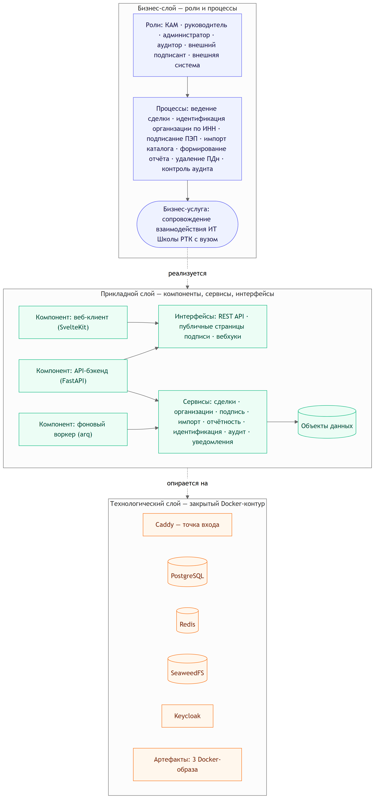
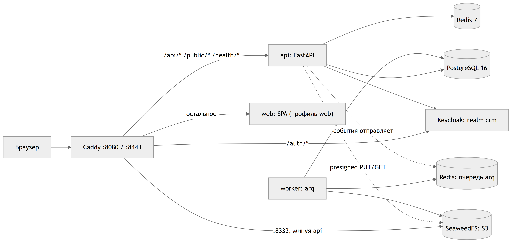

# Сопроводительная документация

## Система контроля и обработки статистических данных по обучению студентов вузов и школ по ИТ‑направлениям

**Внутреннее рабочее имя — RTK School CRM.** Хакатон «Лидеры Цифровой Трансформации» (ЛЦТ), кейс «ИТ Школа Ростелекома».

Документ подготовлен во исполнение п. 6.6–6.7 и п. 10.4 требований кейса (`docs/rtk_requiriments.md`, разделы 4, 6, 10) и описывает: используемые методы обработки данных, условия и ограничения решения, инструкции по компиляции/сборке/установке, функциональную и компонентную архитектуру (в Archi), перечень использованных библиотек и трассировку требований кейса к реализации.

---

## 1. Паспорт проекта и ссылки

| Поле | Значение |
|---|---|
| Заказчик / стейкхолдер | ИТ Школа Ростелекома (подразделение B2B‑продаж образовательных продуктов) |
| Тип системы | Внутренняя корпоративная CRM (не публичный сервис), закрытый контур без доступа во внешнюю сеть в рантайме |
| Класс ИС по 152‑ФЗ | ИСПДн — обрабатывает персональные данные сотрудников вузов и физлиц (B2C); уровень защищённости — УЗ‑3 (предположительно, требует подтверждения моделью угроз) |
| Границы решения | Управление заявками/сделками по вузам и B2C‑физлицам, настраиваемый конструктор workflow, ролевая модель, импорт каталогов, отчётность и дашборды, уведомления, интеграции по API (сайт на Laravel, LMS, Bitrix24), неизменяемый аудит, простая электронная подпись (ПЭП), автоподстановка организаций по ИНН из офлайн‑реестра ЕГРЮЛ |
| Вне границ | Собственный LMS‑функционал, биллинг/бухгалтерия, усиленная квалифицированная подпись (УКЭП) как готовая реализация (заложен только интерфейс-заглушка), нативное мобильное приложение, кадровый учёт |
| Целевой объём | 50 параллельных пользователей, 10 параллельных отчётов, ~100–200 вузов, файлы до 10 ГБ |

**Ссылки** (заполняются на момент сдачи решения — п. 10 кейса):

| Что | Ссылка |
|---|---|
| Репозиторий — backend | https://github.com/lct-testkit/backend |
| Репозиторий — frontend | https://github.com/lct-testkit/frontend |
| Репозиторий — deploy (инфраструктура, CI/CD, офлайн‑установка) | https://github.com/lct-testkit/deploy |
| Репозиторий — rt-ui (дизайн‑система на Svelte) | https://github.com/lct-testkit/rt-ui |
| Организация / продуктовый README | https://github.com/lct-testkit/.github |
| Работающий прототип | https://lct.velikoss.ru — демо‑учётки см. раздел 5.3 |
| Презентация (pptx/pdf) | — добавляется отдельно, вне репозитория с кодом |
| Скринкасты | 1 — работа в платформе: https://vkvideo.ru/video-241860435_456239017?list=ln-WPmur2CyZgH6NB3xN1 · 2 — развёртка офлайн/онлайн в Proxmox: https://vkvideo.ru/video-241860435_456239018?list=ln-TGrbm0XClyNeuXUdsy (полный список — [`docs/SCREENCASTS.md`](SCREENCASTS.md)) |
| Настоящий документ | этот файл, `docs/ACCOMPANYING-DOCUMENTATION.md`, а также экспорт в PDF рядом ([`RTK-School-CRM-Documentation.pdf`](RTK-School-CRM-Documentation.pdf)) |

> Полная внутренняя техническая спецификация решения (доменная модель, сквозные механизмы, детальная проработка сценариев) — в приватном репозитории `dotfiles` (`specs/new_spec.md`, `specs/dop.md`); здесь, в `docs/`, лежат публично цитируемые копии `new_spec.md`/`dop.md`/`rtk_requiriments.md`.

---

## 2. Функциональная и компонентная архитектура (Archi)

Модель архитектуры выполнена в формате ArchiMate 3.x Open Exchange и лежит в этом же репозитории: [`architecture/rtk-school-crm.archimate`](../architecture/rtk-school-crm.archimate) (открывается в [Archi](https://www.archimatetool.com/): File → Import → Open Exchange File). Модель включает три слоя ArchiMate — 49 элементов и 69 связей, без потерянных элементов и с корректно резолвящимися источниками/целями всех связей (подробности и честная оговорка о происхождении модели — [`architecture/README.md`](../architecture/README.md)).



### 2.1. Бизнес‑слой

Роли: **КАМ** (менеджер по вузам), **руководитель** (руководитель КАМов), **администратор платформы**, **аудитор**, **внешний подписант** (представитель вуза/контрагент), **внешняя система** (сайт на Laravel, LMS, Bitrix24).

Процессы, которые эти роли выполняют: ведение сделки по воронке, идентификация организации по ИНН, подписание документов простой электронной подписью, импорт каталога, формирование отчёта, удаление/обезличивание персональных данных, контроль журнала аудита. Все процессы реализуют одну бизнес‑услугу — сопровождение цикла взаимодействия ИТ Школы РТК с вузом от первого контакта до передачи ИТ‑продукта и сопровождения его внедрения (14‑шаговый воркфлоу из п. 2 `rtk_requiriments.md`, реализованный в системе как редактируемый шаблон, а не жёстко прошитый).

### 2.2. Прикладной слой

Три компонента, каждый — самостоятельный артефакт развёртывания:

| Компонент | Технология | Роль |
|---|---|---|
| Веб‑клиент | SvelteKit (SPA, `adapter-static`) | Единственная точка взаимодействия пользователя с системой |
| API‑бэкенд | FastAPI, модульный монолит | Вся бизнес‑логика, REST API, 13 независимых модулей за Protocol‑интерфейсами |
| Фоновый воркер | тот же образ, команда `arq` | Периодические задачи по расписанию и очередь асинхронных событий |

Три интерфейса — REST API (аутентифицированный, Keycloak Bearer/BFF‑cookie), публичные страницы подписи/проверки (`/public/sign/{token}`, `/public/verify/{id}`, без авторизации), вебхуки для входящей интеграции (`/api/v1/integrations/{cms,lms,bitrix}/*`, с HMAC‑подписью).

Прикладные сервисы и объекты данных сгруппированы по 13 модулям бэкенда — таблица с эндпоинтами и таблицами БД на модуль приведена в разделе 5.4 «Компонентная карта бэкенда».

Архитектурный принцип: модуль не импортирует репозитории другого модуля напрямую — кросс‑модульные вызовы идут через сервисные Protocol‑интерфейсы (`OwnershipService`, `DealStatusService`, `NotificationService`, `OutboxService`, `SigningService`, `AntivirusScanner`, `OrgLookupProvider`) с регистрацией реализации на старте процесса. Практическое следствие: любой модуль может быть вынесен в отдельный сервис без переписывания вызывающего кода — это прямой ответ на нефункциональное требование о возможности интеграции в Enterprise‑окружение заказчика (кейс, раздел 9.2).

### 2.3. Технологический слой

Закрытый Docker‑контур из шести работающих сервисов и трёх собственных образов‑артефактов:



| Сервис | Роль |
|---|---|
| Caddy | единая точка входа, TLS‑терминация, реверс‑прокси по DNS с балансировкой `least_conn` (так работает горизонтальное масштабирование `api`) |
| PostgreSQL 16 | основное хранилище приложения |
| Redis 7 | сессии BFF, кэш прав, распределённые локи, идемпотентность интеграций, очередь `arq`, rate‑limit |
| SeaweedFS | S3‑совместимое хранилище файлов, вложений, отчётов, подписанных документов (presigned‑ссылки, браузер обращается напрямую, минуя API) |
| Keycloak (realm `crm`) | OIDC‑провайдер, роли, политика паролей, брутфорс‑защита |
| NTP (`cturra/ntp`) | доверенное время для штампа простой электронной подписи |
| SMS‑gateway‑mock | мок внешнего SMS‑провайдера для доставки OTP ПЭП внутри закрытого контура |

Три Docker‑образа как артефакты: `api`/`worker` (общий образ, разные команды запуска), `web` (статическая SPA‑сборка), `sms-gateway-mock`. Ни один компонент не требует доступа в интернет в рантайме — сборка образов происходит один раз, дальше система работает офлайн (см. раздел 4.2).

---

## 3. Используемые методы обработки данных

### 3.1. Аутентификация и авторизация

Аутентификация построена по паттерну **BFF** (Backend-for-Frontend), а не SPA с токеном в `localStorage`: токен, доступный JS-коду, крадётся любым XSS, а система обрабатывает ИСПДн. Поток входа — OIDC Authorization Code + PKCE (S256) с `state`/`nonce`: SvelteKit-фронтенд без сессионной cookie редиректит на Keycloak, callback обменивает `code` на токены на сервере (секрет клиента не покидает backend), `id_token` проверяется по подписи JWKS, `iss`, `aud`, `nonce`, `exp`. В браузер уходит только `sid` в httpOnly-cookie; сама сессия — запись в Redis с TTL, равным сроку жизни refresh-токена. FastAPI не обращается к Keycloak на каждый запрос: JWT валидируется локально по кэшированному JWKS (TTL 1 час, форс-рефетч при неизвестном `kid`). Тайминги реализованы согласно спецификации: access-токен — 5 мин, refresh — 8 ч с ротацией и reuse-detection, серверная сессия — до 12 ч, idle-таймаут — 30 мин. Логаут реализован во всех заявленных вариантах (локальный, SLO, завершение всех сессий), включая обработку backchannel-логаута от Keycloak с резолвом сессий по `kc_session_state`. Экран «Мои сессии» реализован.

Смена пароля реализована для двух из трёх сценариев ТЗ. Сценарий A (добровольная смена) — реализован полностью: подтверждение текущим паролём, rate-limit 5 попыток / 15 мин, принудительный логаут всех остальных сессий, ротация `sid`, аннулирование ожидающих запросов на подпись, уведомление и событие аудита. Сценарий B (принудительный сброс администратором) — реализован полностью, включая обязательное действие Keycloak `UPDATE_PASSWORD`, безусловное завершение всех сессий пользователя и (при подозрении на компрометацию) отметку связанных подписей как спорных. Сценарий C (самостоятельное восстановление забытого пароля) **не реализован на стороне backend/BFF**: в коде отсутствует какой-либо запрос-эндпоинт, rate-limit по e-mail/IP или отдельное событие аудита для этого сценария — по архитектуре он полностью делегирован собственной странице Keycloac («Забыли пароль»), поэтому его фактическая работоспособность зависит от настроек realm (SMTP, включённая функция), которые не входят в зону этого анализа.

Авторизация — модель **RBAC + ABAC**. Роли живут в Keycloak, но решение о доступе принимает API, поскольку часть правил зависит от данных (например, «КАМ видит только свои сделки»). Реализовано пять ролей — `KAM`, `HEAD`, `ADMIN`, `AUDITOR`, `INTEGRATION` — все зафиксированы также на уровне БД (`CHECK`-constraint на `users.role`). Проверка выстроена в три слоя: (1) грубая отсечка по роли на уровне роутинга; (2) объектный уровень — набор функций вида `deal_in_scope`/`organization_in_scope` (функционально эквивалентен описанному в спецификации `policy.can`, но реализован как отдельные функции по сущностям, а не как единый модуль политики); (3) фильтрация на уровне данных — `scope_filter`, применяемый как реальное условие `WHERE` в SQL-запросе (например, `organization_scope_clause` подставляет `owner_id = :uid OR org.id IN (...)` в список организаций). Именно третий слой — самый надёжный барьер от IDOR, так как защищает даже при ошибке на втором слое. Матрица прав подтверждена точечно: видимость сделок по ролям (свои/команда/все/только источник/нет доступа), право «смена ответственного» — только у `HEAD`, чтение аудит-лога — у `HEAD` в рамках команды, у `ADMIN`/`AUDITOR` — без ограничений. Найдено одно расхождение матрицы со спецификацией: ячейка «AUDITOR — чтение комментариев» не имеет рабочего пути — эндпоинт чтения комментариев требует права, которого у `AUDITOR` нет, а область видимости сделок у этой роли — «нет доступа»; это требует решения владельца спецификации (уточнить матрицу или добавить код), а не считается автоматически исправленной ошибкой.

Отдельно: механизм усиленной повторной аутентификации перед подписанием (step-up, `pep_session`) **заложен только как расширение**: в БД существует допустимое значение метода подписи, но провайдер, проверяющий подтверждение сессии (аналог Keycloak `acr_values`), не реализован — см. §3.4.

### 3.2. Аудит и неизменяемость журнала

Аудит реализован полностью и по глубине превышает минимальное требование спецификации. Каждая запись `audit_log` фиксирует `actor_id`, `actor_role`, `impersonated_by`, `action`, `entity_type/id`, `changes` (JSONB-диф полей), `ip`, `user_agent`, `request_id`, время и результат (включая отказы в доступе — 403 без записи в лог сделал бы попытки обхода прав невидимыми). Чувствительные поля маскируются перед записью.

Неизменяемость обеспечена двумя независимыми механизмами, а не только соглашением: (1) на уровне GRANT прикладная роль БД имеет только `INSERT`/`SELECT` на `audit_log`, `UPDATE`/`DELETE`/`TRUNCATE` отозваны; (2) дополнительно на таблицу навешан триггер `BEFORE UPDATE OR DELETE/TRUNCATE`, который блокирует изменение строки даже для владельца таблицы и суперпользователя — миграция прямо поясняет, что одних GRANT недостаточно. Таблица партиционирована помесячно; при создании новой партиции обе защиты (GRANT и триггеры) переустанавливаются автоматически через отдельную `SECURITY DEFINER`-функцию, ограниченную только таблицами `audit_log*`.

Целостность журнала подтверждается **хеш-цепочкой**: каждая запись хранит `prev_hash`/`hash`, что делает вырезание строки обнаружимым при пересчёте цепочки. Механизм версионирован (`hash_version` 1/2/3): версия 3 использует не простой SHA-256, а HMAC-SHA256 с ключом окружения — это осознанное усиление, потому что чистый SHA-256 пересчитывается любым, кто имеет доступ к БД, и не защищает от атакующего с таким доступом. Важная оговорка для документа: HMAC-режим активен только при заданном ключе окружения; без него цепочка деградирует до версии 2 (обнаруживает случайное повреждение, но не целенаправленную подмену с доступом к БД).

### 3.3. Кэширование, конкурентный доступ и идемпотентность

Кэширование реализовано по схеме версионированных ключей в Redis, что закрывает требование ТЗ «кэш действий пользователя для быстрой загрузки карточек»:

| Ключ | Назначение | TTL |
|---|---|---|
| `cache:deal:{id}:v{version}` | собранная карточка сделки | 10 мин |
| `cache:catalog:{type}:{hash}` | справочники | 1 ч |
| `cache:wf:{id}` | граф статусов workflow | 1 ч |
| `cache:perm:{user_id}` | развёрнутый набор прав | 5 мин |
| `recent:{user_id}` | последние 20 открытых сущностей (ZSET) | LRU |
| `lock:{resource}` | распределённый лок | 30 с |
| `idem:{key}` | результат идемпотентной операции | 24 ч |
| `rl:{ip}:{route}` | счётчик rate-limit | окно |

Принцип — версионный ключ вместо инвалидации по событию, что снимает целый класс «призрачных» багов кэша. Кэш прав инвалидируется после коммита транзакции (не до), чтобы не оставлять окно, в котором читатель видит уже сброшенный, но ещё не обновлённый кэш. Деградация при недоступности Redis предсказуема и осознанно спроектирована: чтение кэша откатывается на прямой запрос к БД, а операции, для которых Redis обязателен (локи, сессии, идемпотентность), возвращают явную ошибку недоступности зависимости, а не тихо теряют гарантию.

Конкурентный доступ к сделке защищён оптимистичной блокировкой: клиент передаёт версию через заголовок `If-Match`, изменение выполняется атомарным `UPDATE ... WHERE version = :expected`, несовпадение версии даёт `409 Conflict`. Для перехода по статусу дополнительно берётся короткий распределённый лок Redis на ресурс `deal:{id}:transition` (TTL 30 с) — это предотвращает двойной побочный эффект при одновременном переходе (дублирование уведомлений и записей истории).

Идемпотентность реализована на двух уровнях: заголовок `Idempotency-Key` + хеш тела запроса образуют ключ, зарезервированный в Redis (`SET NX`, TTL 24 ч) как быстрый путь, и продублированный в таблице Postgres как надёжный fallback на случай недоступности Redis; повторный запрос с тем же ключом и телом возвращает сохранённый ответ, а с тем же ключом, но другим телом — конфликт. Надёжность интеграций дополнительно обеспечена паттерном **transactional outbox / inbox**: исходящее событие пишется в таблицу в одной транзакции с бизнес-изменением, отдельный воркер доставляет его с экспоненциальным backoff (1с, 5с, 30с, 5 мин, 30 мин, 2 ч) и переводом в `dead_letter` после 8 неудачных попыток; входящие сообщения сохраняются целиком до разбора, что не теряет данные при сбое парсера.

### 3.4. Простая электронная подпись (ПЭП)

Модель данных (шесть таблиц: договор ЭДО, шаблон подписи, документ на подпись, запрос подписи, код OTP, сама подпись) реализована в точном соответствии со спецификацией, включая индексы и ограничения целостности. Сам механизм подписания реализован и работает: код OTP хранится хешированным, ограничен по времени жизни и числу попыток; при запечатывании подписи `sha256`-хеш содержимого документа пересчитывается повторно и сверяется с исходным (несовпадение — отказ); на подпись накладывается тег целостности HMAC-SHA256 от хеша содержимого, идентификатора подписанта, времени подписания и одноразового значения; сами подписи образуют **append-only хеш-цепочку** (`prev_hash`/`hash` с сигнальным начальным значением цепи), которая пересчитывается и проверяется отдельным механизмом контроля целостности; предусмотрена версия ключа HMAC для его ротации без потери проверяемости старых записей. Публичные маршруты подписания и верификации (получение документа по токену, запрос и подтверждение OTP-кода, отклонение, публичная проверка подписи) реализованы и защищены rate-limit по токену и по IP; для этих маршрутов существует и фронтенд-интерфейс (страницы подписания и верификации), а не только backend API. Время подписания привязано к доверенному источнику времени: в контуре установки развёрнут отдельный NTP-контейнер, отклонение (`drift_ms`) фиксируется как часть доказательной базы подписи.

Ключевая оговорка для экспертизы: заложенная в спецификации **архитектура подключаемых провайдеров подписи** (абстракция «провайдер подписи» с реализациями для OTP, для повторной аутентификации через сессию и для будущей УКЭП) **не реализована** — в коде она заменена на прямую, жёстко закодированную реализацию единственного метода (ПЭП по OTP) внутри сервисного слоя. Методы «подпись через повторную аутентификацию сессии» и «неквалифицированная/квалифицированная подпись» существуют исключительно как перечисляемые значения и ограничение целостности в БД — без единой строки логики за ними: не реализована ни проверка усиленной сессии, ни класс-заглушка, которую спецификация прямо предполагала как минимум. Таким образом на сегодня в системе работает ровно один способ подписания «под ключ» — ПЭП по SMS/OTP; тезис демонстрации «переход на УКЭП — это добавление нового провайдера» описывает архитектурное намерение, а не реализованную возможность, и в этом виде озвучивать его как факт не следует. Отдельно подтверждено, что подписи защищены и от процедуры удаления персональных данных: наличие подписей у субъекта — блокирующее условие для анонимизации (проверяется как при создании заявки на удаление, так и повторно непосредственно перед исполнением), что соответствует требованию «данные подписи не обезличиваются» (152-ФЗ, ст. 6 ч. 1 п. 5, 7).

### 3.5. Автоподстановка и дедупликация организаций по ИНН

Механизм реализован как цепочка провайдеров с приоритетом: локальный реестр (ЕГРЮЛ-выгрузка в собственной таблице) → внутренний кэш ранее найденных организаций → мок-провайдер (только вне прод-профиля, что закрывает демо без риска для контура) → внешний провайдер. Порядок цепочки на сегодня зашит в коде, а не читается из настроек системы без деплоя, как предполагала последняя строка соответствующего пункта спецификации, — это осознанное и документированное в коде отступление, а не недосмотр.

Внешний провайдер — не DaData (её использование прямо отклонено спецификацией как несовместимое с требованием закрытого контура) и не платный API ФНС, а собственная реализация, обращающаяся к публичной поисковой странице `egrul.nalog.ru`. Она полностью отключена по умолчанию через feature-flag (`external_org_lookup`, посеян как `false`) и включается администратором осознанно — то есть в закрытом контуре по умолчанию не происходит ни одного реального внешнего сетевого вызова для поиска организации.

Валидация контрольных сумм реализована полностью и точно по формулам спецификации: ИНН-10 и ИНН-12 (два контрольных разряда, наборы весов согласно алгоритму ФНС), проверка кода региона и «все цифры одинаковы», КПП (формат из 9 цифр), ОГРН (13 цифр, контроль по модулю 11 и 10) и ОГРНИП (15 цифр, модуль 13 и 10); функция доступна отдельным эндпоинтом валидации. Проверка дублей организаций и применение «дрифта» данных (сверка с найденной записью реестра) реализованы и работают, хотя физически расположены в модуле каталога, а не в модуле реестра — это отличие границ модулей, а не пробел в функциональности.

Честная оговорка, важная для экспертизы: таблица локального реестра ЕГРЮЛ **не наполнена реальным офлайн-набором данных ФНС** — сам код парсера прямо документирует, что он написан по публичному описанию схемы выгрузки, а не проверен на реальном файле-дампе, которого не было доступно в этой среде; демонстрационных данных туда также не подгружается — запись появляется только через реальный административный импорт загруженного XML-файла. Отдельная таблица реестра аккредитованных вузов не наполняется вовсе ни одним из импортёров (принимается только источник «ЕГРЮЛ»), что в коде прямо помечено как осознанная, а не скрытая незаполненность. Итоговый статус механизма — **реализован частично**: алгоритмическая часть (провайдерная цепочка, валидация контрольных сумм, API, таблицы) полностью рабочая; содержательное наполнение реестра реальными данными ФНС — открытый пункт, зависящий от появления реального файла выгрузки.

### 3.6. Импорт каталогов и формирование отчётов

**Импорт каталогов (.xls/.xlsx/.csv)** реализован как обратимый пятифазный процесс. Загрузка идёт через presigned-URL, минуя API. Разбор файла учитывает типовые проблемы русских выгрузок: `xlsx` читается через `openpyxl` в режиме `read_only` (иначе файл на десятки мегабайт съедает гигабайты памяти), `xls` — через `xlrd`, для `csv` кодировка и разделитель определяются автоматически (обязательна поддержка CP1251 и UTF-8 с BOM); входные данные защищены лимитами по размеру и числу строк, проверкой magic bytes и явным запретом формул в ячейках (защита от CSV-инъекции). Автоматический маппинг колонок файла на поля системы выполнен на нечётком сравнении имён по расстоянию Левенштейна — реализация написана внутри проекта без внешней зависимости (сознательное решение для закрытого контура), результат маппинга сохраняется и переиспользуется при повторном импорте того же реестра. Перед применением выполняется прогон без записи (dry-run): проверка форматов и обязательности полей (включая контрольную сумму ИНН и нормализацию телефона), поиск дублей и коллизий с базой, с выгружаемым отчётом об ошибках построчно. Применение идёт батчами, поддерживает три режима (только вставка / upsert по ключу / только обновление), ошибка одной строки не откатывает весь импорт, а для завершённого импорта реализован откат — как удаление созданных им записей, так и восстановление изменённых из сохранённого снимка «до». Механизм полностью реализован и соответствует спецификации по всем описанным пунктам.

**Отчётность и экспорт** реализованы по гибридной архитектуре «синхронно для лёгких, через очередь для тяжёлых» отчётов: лёгкие отчёты (порог — до 1000 строк) отдаются напрямую, тяжёлые ставятся в очередь `report_job`, статус которой опрашивается клиентом, а готовый файл выгружается в объектное хранилище. Параллельность тяжёлых отчётов ограничена настраиваемым лимитом (по умолчанию 10 одновременных задач, превышение — ошибка с кодом ограничения), что и закрывает требование «10 параллельных отчётов» без риска положить базу очередью синхронных запросов. Технически: `xlsx` формируется через `openpyxl` в режиме `write_only` (потоковая запись, константная память), `png`-графики — серверным `matplotlib` с безэкранным backend’ом (не скриншот фронтенда — на сервере нет браузера, это явно отмечено как типичная ловушка). Для PDF в спецификации фигурирует WeasyPrint, но фактически используется `xhtml2pdf` — задокументированная осознанная замена, сделанная ещё в модуле подписания из-за системных зависимостей WeasyPrint, неудобных для среды исполнения, и унаследованная модулем отчётов; итоговый результат — тот же (единый HTML/Jinja2-шаблон → PDF с фирменным стилем), но нужно явно фиксировать это отступление от буквы спецификации при технической защите.

Безопасность выгрузок реализована как отдельный контур: содержимое отчёта фильтруется правами заказчика (не только правами на запуск), каждая выдача файла логируется отдельным типом события аудита с указанием объёма выгруженных данных, ссылка на скачивание — presigned и выдаётся только после проверки прав на доступ к соответствующей сущности, срок жизни ссылки и срок хранения самого файла управляются настройками окружения (реализован как рабочий, настраиваемый механизм; конкретные развёрнутые значения — «15 минут» и «7 дней» из текста спецификации — являются значениями по умолчанию для этих настроек и не проверялись отдельно на конкретном окружении). Внутренние дашборды (Svelte + быстрый рендер графиков) реализованы отдельно от Grafana-дашборда мониторинга, который дополнительно закрывает требование ТЗ об интерактивных дашбордах.

---

## 4. Условия и ограничения решения

Раздел описывает границы применимости решения: при каких правовых, технических и функциональных условиях система работает так, как заявлено, и что осталось за рамками текущей версии. Формулировки ниже — не самокритика, а фиксация фактического состояния кода и среды на дату сдачи, нужная для корректной эксплуатации и для честной оценки решения.

### 4.1. Правовые и нормативные условия

**Классификация по 152-ФЗ.** Система обрабатывает персональные данные двух категорий субъектов: сотрудников/контактов вузов (B2B) и физических лиц — слушателей курсов (B2C). По паспорту проекта это ИСПДн с предполагаемым уровнем защищённости УЗ-3 (специальных и биометрических категорий данных не предусмотрено), однако это предположение, а не результат формальной процедуры категорирования — итоговый уровень защищённости должен быть подтверждён отдельной моделью угроз и актом определения уровня защищённости, которые не входят в состав хакатон-решения.

**Приказ ФСТЭК № 117.** Требования этого приказа формально адресованы государственным информационным системам и системам госорганов/госучреждений; RTK School CRM — корпоративная система коммерческой организации, а не ГИС, и формальная аттестация по приказу не проводилась. ТЗ (п. 6.10) требует соответствия его мерам как ориентиру технической защищённости, и решение выполняет это требование по существу, а не по формальной процедуре: реализованы конкретные технические меры, а не декларации —
- идентификация и аутентификация через Keycloak с парольной политикой;
- управление доступом по модели RBAC+ABAC с разделением ролей администратора и аудитора (см. §4.3 паспорта проекта, роли KAM/HEAD/ADMIN/AUDITOR/INTEGRATION);
- регистрация событий — неизменяемый аудит-лог с hash-chain (append-only, GRANT-ограничение + триггеры `BEFORE UPDATE/DELETE/TRUNCATE`, версионированный хэш с опциональным HMAC-ключом);
- защита при передаче — TLS, защищённые заголовки на каждом ответе Caddy;
- защита при хранении — обособленная роль БД для приложения (только `SELECT`/`INSERT` на `audit_log`), политика доступа к объектному хранилищу без перезаписи/удаления для сервисной роли;
- контроль целостности файлов (`sha256`), миграции только через Alembic, пин зависимостей и сканирование образов.

Прохождение формальной аттестации по 117-му приказу (если она требуется заказчику) — отдельная организационная процедура вне периметра разработки; система подготовлена к ней технически, но не сертифицирована.

**63-ФЗ и границы простой электронной подписи.** Ключ ПЭП в решении — связка идентификатора пользователя/верифицированного контакта и одноразового кода, доставленного по отдельному каналу (реализовано, метод `pep_otp`). По ст. 5 63-ФЗ ПЭП не может подменять усиленную квалифицированную подпись там, где закон прямо требует УКЭП: отчётность в государственные органы, сделки с обязательной нотариальной формой, часть кадровых документов. В решении это учтено осознанно — рамочный договор с вузом ПЭП не подписывается, а требует бумажной формы или внешней УКЭП.

Дополнительное — и более существенное — уточнение для этого раздела: спецификация описывает подпись как архитектуру с подключаемыми методами (`pep_otp`, `pep_session`, `unep`, `ukep`), в которой переход на УКЭП должен сводиться к регистрации новой реализации провайдера. В текущей версии реализован и работает только `pep_otp`; сама подстановочная архитектура (интерфейс `SignatureProvider`) не реализована — `pep_session` (step-up через Keycloak) и `unep`/`ukep` существуют только как значения перечисления и ограничение `CHECK` в БД, без единой строки исполняемой логики. Практический вывод: **сегодня система не может подписать ни один документ, для которого закону нужна УКЭП** — не потому, что это осознанно исключено правовыми основаниями (это верно и оправдано), а потому, что даже промежуточный шаг (пул-провайдерная архитектура и заглушка `UnepProvider`) не были доведены до кода. Это нужно чётко разделять на защите: правовое ограничение — обоснованное решение; отсутствие provider-интерфейса — фактический недоделанный участок.

Отдельный правовой предохранитель, который в решении реализован: запрос подписи для внешнего контрагента блокируется (`blocked_no_agreement`), если с ним нет действующего соглашения об ЭДО (`edm_agreements`) — модель, шесть таблиц и OTP/hash-chain механизм подписания (HMAC-SHA256 привязки к `content_hash`, append-only цепочка с `prev_hash`) реализованы и соответствуют описанным в дополнении требованиям к доказуемости факта подписания.

### 4.2. Технические ограничения среды

**Закрытый контур без интернета.** Целевая среда эксплуатации — изолированная сеть без доступа во внешний интернет. Это прямо определяет реализацию автоподстановки организации по ИНН: внешние коммерческие сервисы (DaData, api-fns.ru) исключены из решения на уровне архитектуры, а не просто выключены в конфиге — они были бы демо-костылём, неработающим в реальном контуре заказчика. Основной провайдер — локальный реестр из открытых данных ФНС (`LocalRegistryProvider`), затем ранее подтверждённые организации базы (`InternalCacheProvider`). Единственный внешний провайдер (`FnsEgrulProvider`, обращение к публичному поиску `egrul.nalog.ru`) выключен по умолчанию флагом `external_org_lookup` и специально не называется в коде и документации «DaData» — это другой, публичный и бесплатный источник; включать его в реально закрытом контуре нельзя, и по умолчанию ни одного обращения во внешнюю сеть система не делает.

Честная оговорка по данным: локальный реестр (`egrul_entries`) поставляется пустым — реальная офлайн-выгрузка ЕГРЮЛ/ЕГРИП ФНС в этой среде разработки была недоступна, и парсер (`egrul_xml.py`) писался по публичной документации схемы, а не проверялся на настоящем XML-дампе. Это прямо задокументировано в коде и README, а не скрытый дефект: при реальном развёртывании администратор обязан загрузить настоящую выгрузку через `POST /api/admin/registry/import`, прежде чем автоподстановка по ИНН начнёт что-то находить. Реестр вузов Рособрнадзора (аккредитация, `university_registry`) в системе предусмотрен схемой, но ни один импортёр его не наполняет — поля аккредитации в ответах всегда пустые.

**Операционная система.** Решение ориентировано только на семейство Linux (Ubuntu/CentOS и аналоги) — это прямое требование ТЗ (п. 6.9) и условие поставки: офлайн-бандл содержит образы Docker, compose-манифест, `SHA256SUMS` и подпись cosign, устанавливается на изолированной машине без сети (`docker load` без обращения к сети), под Windows/macOS-хостом решение не рассчитано на промышленную эксплуатацию.

**Нагрузочные требования.** ТЗ требует устойчивой работы при 50 параллельных пользователях и не менее 10 параллельных построений отчётов разной сложности, с откликом интерфейса не более 1 секунды. В проекте это декомпозировано в бюджет: 100 мс сеть + 50 мс SSR/BFF + 300 мс API (p95) + 150 мс рендер + 400 мс запас, и покрыто методикой нагрузочного тестирования на k6 (профили Smoke/Load/Reports/Stress/Soak), результаты зафиксированного прогона задокументированы в `backend/loadtest/README.md`. Технические условия, которые это ограничивают: один контейнер `api` работает с одним воркером uvicorn (`UVICORN_WORKERS=1`) — горизонтальное масштабирование предполагается только через увеличение числа реплик контейнера, а не многопоточность внутри одного процесса; масштабирование до 300+ пользователей описано в документации как план (PgBouncer, read-реплика, партиционирование, переезд на k3s), но не реализовано и не проверено нагрузочно в текущей версии.

Отдельно стоит отметить, что явных минимальных требований к аппаратным ресурсам (vCPU/RAM) в эксплуатационной документации не зафиксировано — единственная связанная с этим настройка инсталлятора: автоматическое выделение 2 ГБ swap на хосте при подготовке окружения (`install.sh`). Сайзинг под конкретную нагрузку (объём БД, число вложений, ретеншен аудита) заказчику нужно будет уточнять эмпирически при реальном внедрении.

**Шрифты.** Лицензионная гарнитура Rostelecom Basis не входит в git-репозиторий и не встраивается в образ фронтенда (лицензионное ограничение) — без неё интерфейс отображается на резервной гарнитуре — универсальном системном стеке (`-apple-system, Segoe UI, Roboto, Helvetica Neue, Arial`), а не на специально подобранной кириллической альтернативе (в дополнении к ТЗ рекомендовались Golos Text/Inter). Функционально это не блокирует работу, но визуальное соответствие фирменному стилю на стенде без переданных шрифтов будет неполным.

### 4.3. Функциональные ограничения и осознанные допущения

Ниже — то, что реализовано как MVP или сознательно упрощено по архитектурному решению команды, а не по нехватке времени на конкретный код:

- **Дизайн-система (rt-ui).** Реализован вариант «токены + собственные Svelte-компоненты» (вариант A из дополнения к ТЗ), без промежуточного слоя headless-примитивов (Bits UI/Melt UI), который спецификация допускала как облегчённый путь. Фактически сделано глубже заявленного минимума: полный пиксель-в-пиксель порт 111 компонентов и 374 историй Storybook с автоматизированным визуальным сравнением с оригиналом, а не облегчённое 80%-совпадение на ~150 токенах, как было заложено по срокам (3–5 дней). Осознанный побочный эффект — выше стоимость поддержки при обновлении токенов.
- **Автоподстановка по ИНН.** Провайдерная цепочка реализована (локальный реестр → подтверждённые организации → мок вне prod), но порядок и состав цепочки закреплён в коде, а не читается из `system_settings`, как задумано в дополнении к ТЗ («меняется без деплоя») — изменение цепочки провайдеров сегодня требует релиза кода, а не настройки в админке.
- **Интеграция с Битрикс24.** Исходящее направление (CRM → Битрикс24) — рабочая интеграция, проверенная на живом портале, с outbox-очередью, ретраями (задержки 1с/5с/30с/5м/30м/2ч, dead-letter после 8 попыток) и разрешением конфликтов по времени изменения. Входящее направление (Битрикс24 → CRM) сознательно реализовано как упрощённый собственный webhook-контракт, а не разбор реальных событий `ONCRMDEALUPDATE` через OAuth-подписку Битрикс24 — регистрация полноценного приложения на портале заказчика выходит за рамки хакатона и явно описана как ограничение в коде модуля.
- **Восстановление забытого пароля.** Сценарий «забыли пароль» полностью делегирован собственному интерфейсу Keycloak (как и предполагала спецификация) — на стороне CRM/BFF для этого сценария нет ни отдельных rate-limit правил, ни принудительного завершения всех сессий, ни отдельного события безопасности: это станет доступно пользователю только если у realm Keycloak включена и настроена соответствующая функция и SMTP, что не проверялось в рамках этой работы.
- **Конструктор соответствия статусов (мастер миграции воронки).** Реализован вариант «один целевой статус для всех» мигрируемых сделок; вариант с правилами по типу сделки или по сумме сделки принимается формой и сохраняется, но не читается и не исполняется при миграции — по факту работает только половина заявленного в спецификации сценария.
- **Автопереход после подписания всех сторон.** По завершении подписания система фиксирует факт (`signature_status = SIGNED`, событие сделки), но не инициирует автоматический переход по статусу воркфлоу — сопоставление «все подписали → следующий статус» сегодня нужно выполнять отдельным явным переходом, а не автоматически действием перехода.

### 4.4. Известные ограничения текущей версии

Конкретный список по данным `backend/README.md`, `frontend/docs/backend-issues.md` и проверке кода на момент сдачи:

- **Учёт несоответствий.** Отдельный трекер интеграционных проблем (`frontend/docs/backend-issues.md`) фиксирует 101 находку по трём областям (настройка и справочники — 34, CRM — 39, доступы/подпись — 28), 61 из них исправлена полностью или частично, с привязкой к файлу и строке. Открытыми остаются: вход по приглашению в закрытом контуре (без почтового сервера кейклоковское приглашение не работает), удаление сделки, отдельная ручка архивации воронки целиком.
- **Ролевая модель.** Фактически реализовано 5 ролей (KAM, HEAD, ADMIN, AUDITOR, INTEGRATION), а не 4, как иногда упоминается в обсуждениях — обе используемые спецификации согласны на 5 ролях. Найдено одно несоответствие матрицы прав и кода: по матрице AUDITOR должен читать комментарии к сделке, но соответствующий эндпоint требует право, которого у AUDITOR нет, и его собственная область видимости сделок — «нет доступа»; рабочего пути к этой возможности через API сейчас нет.
- **Обезличивание/удаление аккаунта.** Каскад при удалении реализован для сделок, задач, ожидающих подписей, учётной записи Keycloak, аватара и внешних систем (уведомление об обезличивании отправляется в Bitrix/LMS через outbox). Очистка уведомлений, отметка отчётов на перегенерацию и обработка вложений с признаком `contains_pd` — предусмотрены схемой БД, но не подключены к обработчику удаления в этой версии.
- **Проверка условий воркфлоу при публикации.** Валидация перед публикацией графа воркфлоу проверяет условия переходов только по фиксированному списку системных полей; проверка того, что поле `custom_fields.<код>` реально существует в определениях кастомных полей, предусмотрена в движке условий, но не подключается вызывающим кодом — можно опубликовать граф с условием, ссылающимся на удалённое кастомное поле.
- **Мастер передачи дел (offboarding).** Принимает только одного преемника для всех активных сделок увольняемого сотрудника; точечное распределение по отдельным сделкам возможно только отдельной массовой ручкой `POST /deals/bulk/reassign` после основной процедуры.
- **Конфигурация через `.env`.** В контейнеры `api`/`worker`/`migrate`/`seed` попадают только переменные из явного списка `x-api-env` (42 имени) в `docker-compose.yml`. Значения `.env`, не входящие в этот список (лимиты файлов, TTL сессии/CSRF/идемпотентности, часть параметров ПЭП, импорта, приглашений), не действуют в контейнерах — всегда применяется дефолт из `config.py`, даже если в `.env` указано другое. Это нужно учитывать при настройке продуктивного стенда.
- **Ключ HMAC аудита.** `AUDIT_HMAC_KEY` — опциональная переменная. Без неё цепочка аудита защищена только SHA-256 (обнаруживает случайное повреждение, но не пересчёт цепочки атакующим с доступом к БД); ключ нужно явно задать на реальном стенде вместе с `SETTINGS_ENCRYPTION_KEY`.
- **Секреты демо-конфигурации.** `SIGNATURE_SERVER_SECRET`, `KEYCLOAK_CLIENT_SECRET`, `KEYCLOAK_ADMIN_CLIENT_SECRET`, пароли БД и ключи S3 в `.env.example` — заглушки для демонстрации (`crm`, `change-me-in-prod`). Для реальной эксплуатации все они должны быть заменены одновременно; в состоянии «как есть» решение не готово к бою без этой замены.
- **Визуальное регресс-тестирование дизайн-системы.** Собственный CI-прогон визуальных снапшотов (`e2e/visual.spec.ts`) в rt-ui временно красный из-за миграции CI на self-hosted aarch64-раннер при снапшотах, снятых на прежней amd64-архитектуре; сравнение с лицензионным Storybook заказчика (`tools/compare.py`, 374/374 историй) выполняется отдельно и не затронуто, но выполняется только локально/вручную, а не в CI.

---

## 5. Инструкции по компиляции, сборке и установке

Два независимых пути — для разработки/демонстрации на своей машине и для установки на изолированный сервер в закрытом контуре. Оба публикуются и проверяются автоматически (CI, включая e2e‑установку офлайн‑бандла на машине без сети — см. раздел 8 «Проверка качества»), вручную собирать образы из исходников для установки не требуется.

### 5.1. Путь A — сборка из исходников (разработка, демо на своей машине)

Требуется Docker с Compose v2. Интернет нужен только на этапе сборки образов, в рантайме контур закрыт.

```bash
git clone https://github.com/lct-testkit/backend.git && cd backend
cp .env.example .env
docker compose up -d --build
```

Поднимаются 11 сервисов: `postgres`, `redis`, `seaweedfs`, `keycloak`, `ntp`, `sms-gateway-mock`, разовые `migrate` (миграции схемы БД) и `seed` (демо‑данные: две воронки — `b2b_university_v1` на 14 шагов и `b2c_individual_v1` на 6), затем `api`, `worker` и `caddy`. `migrate`/`seed` видны в `docker compose ps -a` со статусом `Exited (0)` после завершения; `api` стартует после успешного `seed` и готовности Keycloak. На чистой машине — около минуты, дольше всего поднимается Keycloak.

Проверка готовности:

```bash
curl http://localhost:8080/health/ready
```

Веб‑клиент — отдельным профилем (собирается из соседнего репозитория `../frontend`, которому нужен пакет дизайн‑системы `rt-ui`):

```bash
git clone https://github.com/lct-testkit/frontend.git ../frontend
docker compose --profile web up -d --build
```

| Адрес | Что это |
|---|---|
| `http://localhost:8080/` | веб‑клиент (профиль `web`) |
| `http://localhost:8080/api/docs` | Swagger UI (в профиле `prod` закрыт, схема остаётся доступной) |
| `http://localhost:8080/api/openapi.json` | OpenAPI 3.0.3, машиночитаемая схема всех операций API |
| `http://localhost:8080/auth` | Keycloak, realm `crm`; консоль администратора — `/auth/admin` |
| `http://localhost:8333` | SeaweedFS S3 через Caddy (presigned‑ссылки, браузер обращается напрямую, минуя API) |
| `https://localhost:8443` | то же по TLS (`tls internal`, самоподписанный сертификат — предупреждение браузера ожидаемо) |

Три особенности, о которые спотыкаются при первом запуске:

1. **Профиль окружения.** `.env.example` задаёт `APP_PROFILE=dev`, дефолт в compose — `demo`. В `dev`/`demo` доступны Swagger UI, вход по Bearer для всех ролей, заглушка автоподстановки ИНН, код ПЭП дублируется в отладочное поле ответа. В `prod` всё это выключено: Swagger закрыт (схема доступна), Bearer — только у служебной роли `INTEGRATION`.
2. **Переменные окружения.** В контейнеры `api`/`worker`/`migrate`/`seed` попадают только переменные из списка `x-api-env` в `docker-compose.yml` — остальные значения `.env` не действуют, пока их туда не добавить.
3. **Код не монтируется.** Образы собираются из `Dockerfile` без bind‑mount — правка кода требует пересборки: `docker compose up -d --build api worker`.

Горизонтальное масштабирование API (Caddy балансирует по DNS `least_conn`):

```bash
docker compose up -d --scale api=3
```

### 5.2. Путь B — установка офлайн‑бандла (закрытый контур, production/демо‑стенд)

Каждый релиз (`vX.Y.Z`) в GitHub Releases репозитория `deploy` публикует единый бандл со всеми Docker‑образами, compose‑файлами, скриптами установки и контрольными суммами. Релиз выходит только после зелёного e2e‑прогона, который включает установку этого бандла на машине **без доступа в сеть** — то есть офлайн‑установка проверяется автоматически на каждый релиз, а не только на бумаге.

На машине с доступом в интернет (или где угодно, куда скачан релиз) — проверка целостности и происхождения:

```bash
sha256sum -c rtk-crm-offline-vX.Y.Z.tar.gz.sha256
cosign verify-blob rtk-crm-offline-vX.Y.Z.tar.gz.sha256 \
  --bundle rtk-crm-offline-vX.Y.Z.tar.gz.sha256.sigstore.json \
  --certificate-identity-regexp '^https://github.com/lct-testkit/deploy/' \
  --certificate-oidc-issuer https://token.actions.githubusercontent.com
```

Перенос бандла на изолированную машину (там уже установлены Docker и `docker compose`) и установка одной командой:

```bash
tar xzf rtk-crm-offline-vX.Y.Z.tar.gz && cd rtk-crm-offline-vX.Y.Z
bash install.sh                                                   # интерактивно: спросит окружение, адрес, демо‑данные
bash install.sh --profile demo --host crm.example.local --seed    # демо‑стенд с моковыми данными, без вопросов
bash install.sh --profile prod --host crm.example.local           # боевое окружение, случайные секреты
```

Ключевые флаги установщика:

| Выбор | Флаг | Значение |
|---|---|---|
| Окружение | `--profile` | `demo` (по умолчанию) — демо‑учётки на экране входа, можно залить моковые данные. `prod` — случайные секреты, демо‑учётки и заливка данных недоступны, обязателен `--host` |
| Адрес | `--host` | Имя/IP системы — попадает в `BASE_URL`, Keycloak, presigned‑ссылки S3, имя TLS‑сайта |
| TLS | `--tls acme\|internal\|off` | `acme` для публичного домена (Let's Encrypt автоматически), `internal` для закрытого контура/IP (самоподписанный сертификат Caddy), `off` для `localhost` |
| Демо‑данные | `--seed` / `--no-seed` | Только для `demo`: заливает справочники, реестр ЕГРЮЛ, ~14 организаций, ~39 сделок по статусам воронки, сценарии «Удаление ПДн» и «Согласования» — идемпотентно |
| Порты | `--port-offset N` | Несколько стендов на одной машине без конфликтов портов |

Требования к серверу и полная процедура (провижининг VM, TLS, шрифты, резервное копирование, Kubernetes/Helm‑альтернатива, устранение неполадок) — [`deploy/RUNBOOK.md`](https://github.com/lct-testkit/deploy/blob/main/RUNBOOK.md).

### 5.3. Демо‑учётки

Создаются при установке с `--profile demo` (импорт realm `crm` из `deploy/keycloak/realm-crm.json`). **Только для демонстрации** — в реальной эксплуатации заменяются.

| Логин | Пароль | Роль |
|---|---|---|
| `kam.ivanov` | `Kam123456789!` | КАМ: свои сделки, организации, подписи |
| `head.petrov` | `Head12345678!` | Руководитель: сделки команды, импорт, переназначение |
| `admin.crm` | `Admin12345678!` | Администратор: все права |
| `admin.volkov` | `Volkov12345678!` | Администратор (второй, для сценариев «четырёх глаз») |
| `auditor.smirnov` | `Audit12345678!` | Аудитор: журнал аудита |

### 5.4. Компонентная карта бэкенда

13 независимых модулей `app/modules/*`, каждый со своими эндпоинтами и таблицами БД (число операций — по тегам `GET /api/openapi.json` на момент сборки этого документа; текущее актуальное число — в README организации):

| Модуль | Что делает |
|---|---|
| `admin` | системные настройки, флаги, чтение/экспорт журнала аудита и проверка его цепочки |
| `audit` | сервис записи в неизменяемый журнал; вызывается всеми модулями в той же транзакции, что бизнес‑изменение |
| `catalog` | организации, контакты, продукты, справочники, лицензии/договоры вуз‑вендор‑ПО |
| `crm` | сделки, переходы по воронке, комментарии, задачи, участники |
| `files` | загрузка через presigned‑URL, проверка magic‑bytes и антивирус‑заглушка, вложения |
| `identity` | аутентификация BFF/OIDC, пользователи, команды, приглашения, согласие на ПДн, обезличивание |
| `imports` | импорт из xlsx/xls/csv/json: профилирование, автоподбор маппинга, dry‑run, применение, откат |
| `integration` | вебхуки CMS/LMS/Bitrix24 с HMAC‑подписью, исходящий outbox с backoff |
| `notification` | уведомления (in‑app, заглушки email/telegram), шаблоны Jinja2 |
| `registry` | автоподстановка и проверка ИНН/ОГРН, локальный реестр ЕГРЮЛ, сверка реквизитов |
| `reporting` | отчёты (xlsx/pdf/png), дашборды с виджетами |
| `signing` | простая электронная подпись: документы, запросы, OTP, публичные страницы подписи и проверки |
| `workflow` | конструктор воронок: статусы, переходы, DSL условий, валидация, публикация |

```
app/
├── main.py              точка входа, сборка FastAPI-приложения
├── api/                  health.py (/health/*, /metrics), docs.py (локальный Swagger UI)
├── core/                 кросс-модульные соглашения: config, errors, security (JWT),
│                         permissions, csrf, rate_limit, idempotency, pagination, masking
├── db/                   базовый класс ORM и реестр моделей для Alembic
├── middleware/           request_context.py: request_id, RED-метрики
├── mocks/                sms_gateway.py — мок SMS-провайдера
├── modules/               13 модулей, перечислены в таблице выше
├── assets/fonts/         DejaVu Sans — кириллица в PDF и графиках отчётов
└── worker/main.py        arq: воркер и планировщик периодических задач
migrations/versions/      миграции Alembic
tests/                    офлайн + сквозные тесты (реальная PostgreSQL)
loadtest/                 Locust: сценарии и README с результатами нагрузочного теста
deploy/                   Caddyfile, entrypoint.sh, keycloak/realm-crm.json, postgres/, seaweedfs/
```

---

## 6. Используемые библиотеки и компоненты

Версии — из `frontend/package.json` и `backend/pyproject.toml`. Полная таблица с версиями и назначением каждого пакета (клиент, бэкенд, инфраструктурные образы) поддерживается в одном месте и не дублируется здесь во избежание расхождения версий — [`README организации, раздел «Используемые библиотеки»`](https://github.com/lct-testkit/.github#используемые-библиотеки). Кратко, по слоям:

- **Клиент**: SvelteKit 2 + Svelte 5 (SPA, `adapter-static`), TypeScript (strict), Tailwind CSS 4, `@lct-testkit/rt-ui` (дизайн‑система Ростелекома, порт на Svelte — см. раздел 4.3), `openapi-fetch`/`openapi-typescript` (типизированный клиент из схемы API), `@xyflow/svelte` (холст графа для редактора воронки), `pdfjs-dist` (просмотр PDF на подпись), `marked`+`dompurify` (рендер справки), `vitest`+`playwright` (тесты).
- **Бэкенд**: FastAPI + `uvicorn`, `pydantic`/`pydantic-settings`, SQLAlchemy 2 (async) + `asyncpg` + `alembic`, `redis`, `arq` (фоновые задачи), `pyjwt` (проверка JWT Keycloak), `structlog` + `prometheus-client` (наблюдаемость), `openpyxl`/`xlrd` (импорт xlsx/xls), `lxml` (потоковый разбор выгрузки ЕГРЮЛ), `bcrypt` (хранение OTP), `xhtml2pdf`+`Jinja2`+`pypdf`+`qrcode` (генерация и штамп PDF при подписании), `ntplib` (доверенное время подписи), `matplotlib` (графики отчётов), `pytest`/`ruff`/`locust` (тесты, линт, нагрузка).
- **Инфраструктура**: `postgres:16-alpine`, `redis:7-alpine`, `chrislusf/seaweedfs:3.68`, `quay.io/keycloak/keycloak:25.0`, `caddy:2.11-alpine`, `cturra/ntp`.

Все методы API документированы и доступны через Swagger UI (`/api/docs`, схема `/api/openapi.json`, OpenAPI 3.0.3) — п. 6.2 кейса.

---

## 7. Соответствие требованиям кейса

Трассировка составлена по `docs/rtk_requiriments.md` (раздел 4 «Требования к сервису» — функциональные п.1–13 и нефункциональные п.1–7 — и раздел 6 «Требования к решению» п.1–10) и уточняет черновую таблицу из `.github/README.md` (строки 372–402) по проверенным фактам реализации на 2026‑09‑29. Обозначения в колонке «№»: **Ф** — функциональные требования раздела 4, **Н** — нефункциональные требования раздела 4, **Р** — требования к решению раздела 6.

| № пункта ТЗ | Требование (кратко) | Статус | Где реализовано |
|---|---|---|---|
| Ф.1 | Фильтрация данных за период по вузам/направлениям/продуктам/ответственным; визуализация статистики (диаграммы, графики png/pdf) | реализовано | `backend/app/modules/reporting` (8 шаблонов отчётов); фильтры — `frontend/src/lib/features/crm/deals/list/dealFilters.ts`; графики — `matplotlib` (сервер, png/pdf), `@lct-testkit/rt-ui/charts` в `WidgetBody.svelte` (клиент) |
| Ф.2 | Визуализация пути вуза: переход статус→статус, правка имён статусов, комментирование при переходе | реализовано | `backend/app/modules/workflow` (`models.py::WorkflowTransition.requires_comment`, DSL guard-условия в `dsl.py`); редактор графа — `config/workflows/editor` (`@xyflow/svelte`), `crm/deals/card/TransitionDialog.svelte` |
| Ф.3 | Прикладывание файлов к статусам (png, jpeg, pdf, zip, gzip, rar, doc, docx, xls, xlsx) | реализовано (с оговоркой) | `ALLOWED_FILE_EXTENSIONS` в `backend/.env.example` (тот же список + jpg/xml/csv), `backend/app/modules/files` (S3); антивирус-проверка — заглушка, статус «карантин» не присваивается |
| Ф.4 | Формирование отчётов за период в xls/xlsx/pdf по колонкам: вуз, направление, продукт, статус, ответственный | реализовано (с оговоркой) | `backend/app/modules/reporting`; поддержаны `xlsx`/`pdf`/`png`, устаревший бинарный `.xls` не выдаётся |
| Ф.5 | Приём данных сайта и LMS по API в JSON, добавление в существующий/новый workflow | реализовано (с оговоркой) | `backend/app/modules/integration` — `POST /api/v1/integrations/{cms/leads, lms/progress}` (JSON, HMAC-подпись). По направлению это входящие вебхуки (сайт/LMS сами шлют данные), а не активный «забор» CRM по расписанию, как буквально в ТЗ — результат для пользователя тот же. Сверх ТЗ: аналогичный исходящий коннектор для Битрикс24, проверенный на живом портале (outbound — реальный; inbound — упрощённый собственный контракт, не настоящая подписка на события Bitrix) |
| Ф.6 | Создание/изменение workflow (базовый — 14 шагов из раздела 2), допускается креатив и ИИ | реализовано | `backend/app/modules/workflow/seed.py` — сиды `b2b_university_v1` (14 шагов, совпадает с разделом 2 кейса) и `b2c_individual_v1` (6 шагов, авторское дополнение); редактор воронки на фронтенде |
| Ф.7 | Соответствие ИБ по 152-ФЗ «О персональных данных» и приказу ФСТЭК №117 | частично | Аудит с неизменяемой hash-цепочкой (GRANT + BEFORE UPDATE/DELETE-триггер) — `backend/app/modules/audit`, `migrations/versions/{0001_baseline,0002_identity_sprint,0012_audit_role_hardening,0018_revoke_definer_public}.py`; RBAC/ABAC с орг-скоупингом на уровне SQL-фильтра — `backend/app/core/permissions.py`, `catalog/service.py::organization_scope_clause`; маскирование контактных данных за правом `contact:reveal`. Не хватает: каскад анонимизации при удалении аккаунта (`identity/erasure_service.py`) осознанно не чистит уведомления и `report_jobs` (задокументировано в `notification/models.py:16-21`) |
| Ф.8 | Выдача файла отчёта в xls/xlsx/pdf по запросу визуализации | реализовано (та же оговорка, что в Ф.4) | `backend/app/modules/reporting` |
| Ф.9 | Возможность системы корректировать и создавать новые workflow | реализовано | `backend/app/modules/workflow` — состояния `draft/published/archived`, 5 проверок публикации в `service.py::_validate_graph_data` (единственный initial, ≥1 terminal, BFS-достижимость, BFS-тупики, валидность DSL) |
| Ф.10 | Реализация авторизации через Keycloak | реализовано | `docker-compose.yml` (сервис `keycloak:25.0`, realm `crm`); `backend/app/modules/identity/{router_auth.py,keycloak.py,session_store.py}` — PKCE, state/nonce, BFF-сессии (кука `sid`, токены в Redis), 3 уровня logout, backchannel logout |
| Ф.11 | Ролевая модель: Пользователь / Руководитель / Администратор | реализовано (шире ТЗ) | `backend/app/modules/identity/models.py` (`Role`: KAM=Пользователь, HEAD=Руководитель, ADMIN=Администратор + AUDITOR, INTEGRATION сверх ТЗ); орг-скоуп КАМ — `catalog/service.py::organization_scope_clause`; переназначение ответственных у HEAD — `permissions.py::DEAL_REASSIGN`. Нюанс сверх обязательных 3 ролей: ячейка расширенной матрицы «AUDITOR читает комментарии» не имеет рабочего пути в коде |
| Ф.12 | Реализация взаимодействия через веб-интерфейс | реализовано | `frontend/` — SvelteKit SPA, весь функционал доступен через веб |
| Ф.13 | Кэш работы действий пользователя | реализовано | `backend/app/core/{cache.py, redis_client.py, idempotency.py, optimistic.py}` — кэш карточки сделки/каталога/графа workflow/прав принципала, идемпотентные ключи (TTL 24ч), распределённые локи на переходы статуса; сервис `redis` в `docker-compose.yml` |
| Н.1 | Отклик ≤1с (переход статуса, комментарий, изменение выборки отчёта) | реализовано (замер на 2026‑09‑18, не переигрывался) | `backend/loadtest/README.md` — p95 79мс (переход статуса), 49мс (комментарий) при целевых ≤300мс |
| Н.2 | Страница не перезагружается/не сбрасывается при изменениях | реализовано | `frontend/` — SPA-архитектура (SvelteKit) |
| Н.3 | Коды ошибок при проблемах в функционале | реализовано | Единый каталог `CRM-XXYY` в формате RFC 7807 Problem Details на каждой ошибке API; `frontend/src/lib/api/errors.ts` |
| Н.4 | Интерфейс интуитивно понятен | реализовано (качественно, через дизайн-систему) | Единая раскладка блоков `frontend/src/lib/ui`, обязательные состояния загрузка/пусто/ошибка, адаптация таблица→карточки на телефоне, библиотека компонентов `rt-ui` |
| Н.5 | Документация (руководство пользователя и руководство системного администратора) встроена в платформу, со скриншотами | реализовано (с оговоркой) | `frontend/src/lib/content/help/*.md` — 13 глав встроенной справки (`/help`), скриншоты — `frontend/static/help/*.png`; администрирование покрыто главой `06-admin.md` внутри того же раздела, а не отдельным «руководством системного администратора» — эксплуатационная часть (установка, TLS, резервное копирование, мониторинг, устранение неполадок) находится вне платформы, в `deploy/RUNBOOK.md` (см. раздел 5 настоящего документа) |
| Н.6 | Нагрузка 50 параллельных пользователей | частично | `backend/loadtest` — профиль `Load` на 50 VU пройден; авторы теста отмечают, что переход по статусу не дотянул до целевого RPS на тестовом стенде (упор в ресурсы стенда, не в архитектуру) |
| Н.7 | Нагрузка 10 параллельных отчётов разной сложности | частично | `REPORTS_MAX_CONCURRENT=10` в `backend/.env.example` — лимит заведён как конфигурация; отдельного нагрузочного прогона именно на построение 10 параллельных отчётов разной сложности в документации не зафиксировано |
| Р.1 | Backend: java springboot/kotlin \| python \| node.js; Frontend: react; БД: возможен postgresql | частично | Backend — Python/FastAPI (`backend/pyproject.toml`) и PostgreSQL (`docker-compose.yml`) — соответствуют допустимым альтернативам ТЗ. Frontend сделан на SvelteKit/Svelte (`frontend/package.json`, `frontend/src/routes`), а не на React — единственной позиции этого пункта, заданной в ТЗ без альтернатив; осознанное технологическое решение, а не недосмотр |
| Р.2 | Swagger UI на все методы + перечень использованных библиотек | реализовано | `http://localhost:8080/api/docs` (схема доступна всегда, UI закрыт в prod); раздел «Используемые библиотеки» в `.github/README.md` |
| Р.3 | Решение — отдельный сервис, может стать независимой ИС | реализовано | `deploy/compose/` (образы для сервера/кластера), `deploy/charts/rtk-crm/` (Helm/Kubernetes), офлайн-поставка одним архивом — `deploy/RUNBOOK.md` |
| Р.4 | Формирование результирующего JSON-файла + Docker-контейнеризация | реализовано | Экспорт аудит-журнала `GET /admin/audit/export` (`.ndjson`, `backend/app/modules/admin/router.py`) и `openapi.json`; 11 сервисов в `backend/docker-compose.yml` + образ `web`, все на Linux-базах |
| Р.5 | Комментарии к сложным техническим/логическим деталям | реализовано | Развёрнутые докстринги с объяснением отступлений — `backend/app/modules/registry/{providers.py:5-10, egrul_xml.py:1-26}`, `integration/bitrix.py` (докстринг про упрощённый inbound-контракт), `notification/models.py:16-21`, `audit/service.py` (версионирование hash-цепочки) |
| Р.6 | Обязательное наличие сопроводительной документации | реализовано | `.github/README.md` (настоящий документ), `backend/README.md`, `deploy/RUNBOOK.md`, `architecture/README.md` |
| Р.7 | Документация описывает методы обработки данных, условия/ограничения, инструкции по сборке/установке, архитектуру в Archi | реализовано (с оговоркой по Archi) | Установка/сборка — `deploy/RUNBOOK.md`, `backend/README.md`; условия и ограничения — раздел 4 «Условия и ограничения» настоящего документа; архитектура — [`architecture/rtk-school-crm.archimate`](architecture/rtk-school-crm.archimate) (ArchiMate 3.x, 3 слоя, 49 элементов, 69 связей), собран вручную по коду без графического Archi в среде подготовки — детали в `architecture/README.md` |
| Р.8 | Открытый, не скомпилированный код без обфускации | реализовано | Обычные `.py`/`.ts`/`.svelte`-файлы без сборки в бинарь и без обфускации — весь репозиторий |
| Р.9 | Работа сервиса на Linux (ubuntu, centos и др.) | реализовано | Все образы `docker-compose.yml` на Linux-базах (`python:3.12-slim`, `*-alpine`, Keycloak на UBI); офлайн-инсталлятор рассчитан на Linux-хост |
| Р.10 | Соответствие 149-ФЗ/152-ФЗ и госстандартам на автоматизированные системы | частично | Та же база, что в Ф.7 — неизменяемый аудит, RBAC/ABAC, маскирование ПДн, механизм анонимизации (частичный каскад); формальная сертификация по ФСТЭК/аттестация ГИС не проводилась — вне охвата хакатон-решения |

Из 30 проверенных пунктов 25 реализованы полностью и 5 — частично; пунктов без какой-либо реализации не найдено. Частичные пункты образуют три группы: (1) технологический стек фронтенда (Р.1) — бэкенд на Python и БД на PostgreSQL выбраны из допустимых ТЗ альтернатив, но фронтенд сделан на Svelte, а не на React, единственно указанном в этом пункте; (2) нагрузочные характеристики (Н.6, Н.7) — тест на 50 VU пройден, но, по признанию самих авторов теста, ограничен ресурсами тестового стенда, а лимит на 10 параллельных отчётов заведён как конфигурация без отдельного подтверждающего прогона; (3) требования 152-ФЗ/ФСТЭК (Ф.7, Р.10) — аудит с неизменяемой hash-цепочкой и RBAC/ABAC с орг-скоупингом реализованы полностью, но каскад анонимизации при удалении аккаунта осознанно не покрывает очистку уведомлений и `report_jobs`, что прямо задокументировано в коде как отложенное, а не скрытый пробел. Ни одно из отступлений не является следствием недосмотра — каждое явно объяснено в коде или в разделе 4 «Условия и ограничения» настоящего документа — и ни одно не блокирует базовый пользовательский путь кейса: каталоги, воронка/workflow, отчёты, ролевая модель, Keycloak-авторизация и кэш работают end-to-end.

---

## 8. Связанная документация

Этот документ — сводный, обязательный по п. 6.6–6.7 и 10.4 кейса. Он ссылается на более подробные источники вместо дублирования их содержимого, чтобы не расходиться с ними по мере изменения кода:

| Документ | Что содержит |
|---|---|
| [`backend/README.md`](https://github.com/lct-testkit/backend#readme) | Быстрый старт, полная компонентная карта, конфигурация, разработка, CI/CD, известные ограничения |
| [`deploy/RUNBOOK.md`](https://github.com/lct-testkit/deploy/blob/main/RUNBOOK.md) | Провижининг VM, офлайн‑установка, TLS, резервное копирование и восстановление, Kubernetes/Helm, устранение неполадок — фактическое руководство системного администратора |
| [`architecture/rtk-school-crm.archimate`](../architecture/rtk-school-crm.archimate) + [`architecture/README.md`](../architecture/README.md) | Модель ArchiMate (открывается в Archi) и пояснение к ней |
| [`.github/README.md`](https://github.com/lct-testkit/.github#readme) | Продуктовый README организации: демо, сценарии по ролям, полная таблица библиотек, проверка качества, соответствие требованиям кейса (первичная версия таблицы раздела 7) |
| `frontend`, раздел `/help` (после входа в систему) | Встроенное в платформу руководство пользователя — 13 глав со скриншотами реального интерфейса |
| [`backend/loadtest/README.md`](https://github.com/lct-testkit/backend/blob/main/loadtest/README.md) | Методология и результаты нагрузочного тестирования |
| [`rtk_requiriments.md`](rtk_requiriments.md), [`new_spec.md`](new_spec.md), [`dop.md`](dop.md) | Исходное ТЗ кейса и полная техническая спецификация решения (доменная модель, сквозные механизмы, детальная проработка сценариев, модель данных) — первоисточник для раздела 3 настоящего документа |

Настоящий документ подготовлен 2026‑09‑29 на основании кода и документации, актуальных на эту дату. Числовые показатели (число операций API, тестов, компонентов) могут измениться в последующих релизах — актуальные значения смотрите в README организации по ссылке выше.
