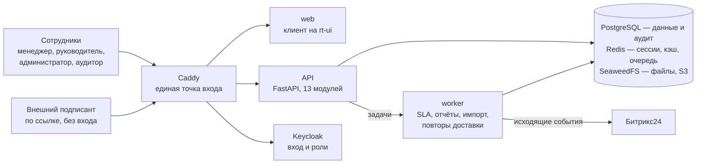
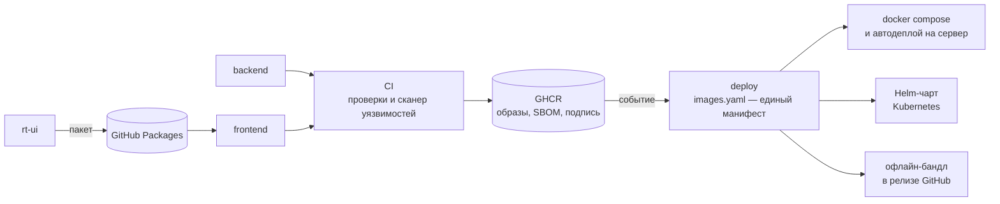

# Тесткит

**Команда «Тесткит» · CRM для ИТ Школы Ростелекома**

Внутренняя CRM для продаж образовательных программ вузам и физлицам: воронки со сроками (SLA), автоподстановка организации по ИНН, электронная подпись (ПЭП), неизменяемый аудит. Работает в закрытом контуре, без интернета в рантайме.

<!--STATS-->
**181** операция API &nbsp;·&nbsp; **65** таблиц &nbsp;·&nbsp; **459** тестов бэкенда &nbsp;·&nbsp; **232** теста клиента &nbsp;·&nbsp; **47** экранов &nbsp;·&nbsp; **4** роли &nbsp;·&nbsp; **4** темы &nbsp;·&nbsp; **111** компонентов в своей дизайн-системе
<!--/STATS-->

[Что мы сделали](#что-мы-сделали) · [С чего начать](#с-чего-начать) · [Репозитории](#карта-репозиториев) · [Как устроено](#как-устроено) · [Попробовать](#попробовать) · [Что внутри](#что-внутри) · [Соответствие кейсу](#соответствие-требованиям-кейса) · [Проверка качества](#как-мы-это-проверяли) · [Документы](#документы)

|  |  |
|:-:|:-:|
| *Главная менеджера: KPI, что требует внимания, задачи* | *карточка сделки: шаги воронки, вкладки, тёмная тема* |

## Что мы сделали

ИТ Школа Ростелекома продаёт образовательные программы вузам и колледжам (B2B) и физическим лицам (B2C). Путь от первого контакта до запуска обучения вёлся вручную и нигде не был виден целиком. Мы сделали систему, которая ведёт этот путь как сделку в настраиваемой воронке, следит за сроками, узнаёт организацию по ИНН, принимает каталоги из таблиц, считает отчёты, подписывает документы и записывает каждое действие в журнал, который нельзя переписать. Всё это — по 152-ФЗ и в закрытом контуре.

* **Воронка — данные, а не код.** Статусы, переходы, условия и сроки собираются в графовом редакторе и публикуются без правки кода. Готовы две воронки: 14 шагов для вузов (ровно список из задания) и 6 шагов для физлиц.
* **Организация находится по одному полю.** ИНН или название ищутся в локальном реестре ЕГРЮЛ (без внешней сети): подсказки, дубли, расхождения реквизитов.
* **Подпись, которую можно проверить.** Простая электронная подпись: код по независимому каналу, протокол, хэш и QR на штампе; публичная страница проверки сверяет подпись по номеру или по файлу.
* **Аудит нельзя переписать.** Записи журнала связаны цепочкой хэшей, а роли приложения в базе запрещены `UPDATE` и `DELETE` над журналом на уровне `GRANT`.
* **Битрикс24 проверен на живом портале.** Сделка из CRM появилась на портале компании через очередь исходящих событий. [Весь путь, от запроса до записи в базе, — с логами и схемой](https://github.com/lct-testkit/frontend#интеграция-с-битрикс24).
* **Своя дизайн-система.** Интерфейс собран на `rt-ui` — нашем порте дизайн-системы Ростелекома на Svelte 5: четыре темы, таблица, рассчитанная на десятки тысяч строк, графики; каждая эталонная история сверяется с оригиналом пиксель в пиксель. В самом приложении раздел «Справка» показывает эти компоненты вживую.
* **Доставка до закрытого контура.** Образы в реестре, docker compose, Helm-чарт, автодеплой на сервер и офлайн-бандл со всеми образами в релизе.

## С чего начать

| Вы… | Идите сюда |
|---|---|
| **член жюри**, хотите сверить с требованиями кейса | [Соответствие кейсу](#соответствие-требованиям-кейса) → [то же подробно](https://github.com/lct-testkit/.github#соответствие-требованиям-кейса) |
| хотите **запустить и потрогать** | [Попробовать](#попробовать) · вход в демо — выбором роли в один клик |
| хотите понять **устройство** | [Как устроено](#как-устроено) · [схема в Archi](https://github.com/lct-testkit/.github/tree/main/architecture) · [техническое задание](https://github.com/lct-testkit/.github/blob/main/docs/new_spec.md) |
| **бэкенд**: API, модель данных, права, аудит | [`backend`](https://github.com/lct-testkit/backend#readme) · [контракт `openapi.json`](https://github.com/lct-testkit/backend/blob/main/openapi.json) |
| **интерфейс**: экраны, блоки, права, проверка | [`frontend`](https://github.com/lct-testkit/frontend#readme) · [пользовательские потоки](https://github.com/lct-testkit/frontend/blob/main/docs/USERFLOWS.md) |
| **дизайн-система** | [`rt-ui`](https://github.com/lct-testkit/rt-ui#readme) · [как сверяется с оригиналом](https://github.com/lct-testkit/rt-ui/blob/main/docs/DESIGN-SYSTEM-PORT.md) |
| **эксплуатация**: сервер, обновление, откат, Kubernetes | [`deploy`](https://github.com/lct-testkit/deploy#readme) · [RUNBOOK](https://github.com/lct-testkit/deploy/blob/main/RUNBOOK.md) |

## Карта репозиториев

| Репозиторий | Что это | Стек | Начать с |
|---|---|---|---|
| [**`backend`**](https://github.com/lct-testkit/backend) | API: модульный монолит из 13 модулей, миграции, фоновый воркер | Python · FastAPI · SQLAlchemy 2 · PostgreSQL · Redis · arq · Keycloak · SeaweedFS (S3) | [README](https://github.com/lct-testkit/backend#readme), [Swagger и запуск](https://github.com/lct-testkit/backend#быстрый-старт), [безопасность](https://github.com/lct-testkit/backend#безопасность) |
| [**`frontend`**](https://github.com/lct-testkit/frontend) | Веб-клиент: четыре роли, четыре темы, десктоп и телефон | SvelteKit · Svelte 5 · TypeScript · Tailwind v4 | [README](https://github.com/lct-testkit/frontend#readme), [блоки интерфейса](https://github.com/lct-testkit/frontend#блоки-интерфейса), [редактор воронки](https://github.com/lct-testkit/frontend#редактор-воронки-графовый-конструктор) |
| [**`rt-ui`**](https://github.com/lct-testkit/rt-ui) | Дизайн-система Ростелекома на Svelte 5: компоненты, иконки, темы, графики | Svelte 5 · TypeScript · CSS-токены | [README](https://github.com/lct-testkit/rt-ui#readme), [как доказываем совпадение](https://github.com/lct-testkit/rt-ui#как-мы-доказываем-совпадение) |
| [**`deploy`**](https://github.com/lct-testkit/deploy) | Поставка: манифест образов, CI/CD, compose, Helm, автодеплой, офлайн-бандл | GitHub Actions · GHCR · Docker Compose · Helm · systemd | [README](https://github.com/lct-testkit/deploy#readme), [RUNBOOK](https://github.com/lct-testkit/deploy/blob/main/RUNBOOK.md), [релизы](https://github.com/lct-testkit/deploy/releases) |
| [**`.github`**](https://github.com/lct-testkit/.github) | Этот гид, README продукта целиком, техническое задание, архитектура в Archi | Markdown · ArchiMate | [README продукта](https://github.com/lct-testkit/.github#readme) |

## Как устроено

Бэкенд сам выступает BFF: при входе через Keycloak токены остаются в Redis, а браузер получает только `httpOnly`-cookie. Файлы идут напрямую в S3 по временным ссылкам, минуя API. Подробнее: [`backend`](https://github.com/lct-testkit/backend#как-устроено), [`frontend`](https://github.com/lct-testkit/frontend#как-устроено); функциональная и компонентная архитектура — [в Archi](https://github.com/lct-testkit/.github/tree/main/architecture).

Образ попадает в реестр только после зелёных проверок и сканирования уязвимостей; `deploy` хранит единый манифест образов, из которого собираются все три способа развёртывания. Устройство конвейера — в [RUNBOOK](https://github.com/lct-testkit/deploy/blob/main/RUNBOOK.md).

## Попробовать

| Способ | Что нужно | Как |
|---|---|---|
| **Офлайн-бандл** — быстрее всего | Docker и Docker Compose; интернет после скачивания не нужен | Скачать архив из [последнего релиза `deploy`](https://github.com/lct-testkit/deploy/releases/latest), распаковать и запустить `install.sh`; шаги и проверка целостности — в [RUNBOOK](https://github.com/lct-testkit/deploy/blob/main/RUNBOOK.md#офлайн-установка-закрытый-контур) |
| **Из исходников** — для разработки | Docker, Node.js, pnpm, токен чтения пакета `rt-ui` из GitHub Packages | `backend`: `docker compose up -d --build`; `frontend`: `pnpm install && pnpm dev`. Порты, демо-данные, неполадки — [README продукта](https://github.com/lct-testkit/.github#быстрый-старт) |
| **Готовые образы на сервере** | Ubuntu или Debian с systemd, доступ к реестру образов | Провижининг, первый деплой, автодеплой, откат — [RUNBOOK](https://github.com/lct-testkit/deploy/blob/main/RUNBOOK.md) |

Вход в демо-режиме — на экране «Выберите роль», паролей вводить не нужно. Менеджер по вузам — «Иван Тесткитович»; ещё есть руководитель, администратор и аудитор. После входа примите согласие на обработку персональных данных — так работает и боевая версия. Swagger UI открывается на `/api/docs`.

## Что внутри

| | Возможность | Где смотреть |
|---|---|---|
| 💼 | **Сделки и воронка**: переходы с условиями и обязательными комментариями, сроки SLA, доска по статусам, массовая передача, конфликты версий | [экраны и права](https://github.com/lct-testkit/frontend#экраны-и-права) · [пользовательские потоки](https://github.com/lct-testkit/frontend/blob/main/docs/USERFLOWS.md) |
| 🧭 | **Графовый редактор воронки**: узлы-статусы, рёбра-переходы, условия, сроки, проверка до публикации, мастер переноса сделок | [редактор воронки](https://github.com/lct-testkit/frontend#редактор-воронки-графовый-конструктор) |
| 🏛 | **Организации и ЕГРЮЛ**: автоподстановка по ИНН, поиск дублей, дрейф реквизитов | [`catalog`](https://github.com/lct-testkit/backend/tree/main/app/modules/catalog) · [`registry`](https://github.com/lct-testkit/backend/tree/main/app/modules/registry) |
| ✍️ | **Подпись ПЭП**: запрос, код по независимому каналу, штамп с QR, публичная проверка, соглашения об ЭДО | [`signing`](https://github.com/lct-testkit/backend/tree/main/app/modules/signing) |
| 📥 | **Импорт каталогов** из xlsx, xls, csv: сопоставление колонок, пробный прогон, откат | [`imports`](https://github.com/lct-testkit/backend/tree/main/app/modules/imports) |
| 📊 | **Отчёты и дашборды**: 8 шаблонов, выгрузка в xlsx, pdf и png, графики | [`reporting`](https://github.com/lct-testkit/backend/tree/main/app/modules/reporting) |
| 🛡 | **Права, аудит, персональные данные**: четыре роли, «четыре глаза», журнал с цепочкой хэшей, удаление ПДн по запросу | [безопасность бэкенда](https://github.com/lct-testkit/backend#безопасность) |
| 🔌 | **Интеграции**: приём данных с сайта и из LMS, исходящая доставка в Битрикс24 | [проверка на живом портале](https://github.com/lct-testkit/frontend#интеграция-с-битрикс24) |
| 🎨 | **Дизайн-система `rt-ui`**: четыре темы, таблица, графики, адаптивность | [`rt-ui`](https://github.com/lct-testkit/rt-ui#readme) |

|  |  |
|:-:|:-:|
| *сделки доской по статусам воронки* | *редактор воронки: граф статусов, панель свойств* |
|  |  |
| *новая организация: автоподстановка по ИНН* | *подписание: входящие и просмотр документа* |
|  |  |
| *отчёты и дашборд* | *журнал аудита: проверка цепочки хэшей* |

*Один экран в четырёх темах (Rostelecom и Purple × светлая и тёмная); тема — один CSS-класс. Телефон — не уменьшенный десктоп: таблицы становятся карточками, нажимаемые цели не меньше 44 px.*

## Соответствие требованиям кейса

Только то, что подтверждено кодом или конфигурацией. Полная таблица с путями к файлам — в [README продукта](https://github.com/lct-testkit/.github#соответствие-требованиям-кейса).

| Требование | Где реализовано |
|---|---|
| Каталоги продуктов, направлений, вузов и ответственных; загрузка xls и xlsx с сопоставлением полей | [`catalog`](https://github.com/lct-testkit/backend/tree/main/app/modules/catalog), [`imports`](https://github.com/lct-testkit/backend/tree/main/app/modules/imports): файл → профиль → маппинг → пробный прогон → применение → откат |
| Отчёты за период с фильтрами; экспорт xlsx и pdf, графики png и pdf | [`reporting`](https://github.com/lct-testkit/backend/tree/main/app/modules/reporting): 8 шаблонов; форматы `xlsx`, `pdf`, `png` |
| Путь по вузу статус за статусом, правка статусов, комментарий при переходе; базовая воронка из кейса | [Графовый редактор](https://github.com/lct-testkit/frontend#редактор-воронки-графовый-конструктор); воронка `b2b_university_v1` из 14 шагов — [сид](https://github.com/lct-testkit/backend/blob/main/app/modules/workflow/seed.py) |
| Файлы к статусам (png, jpeg, pdf, zip, gzip, rar, doc, docx, xls, xlsx) | [`files`](https://github.com/lct-testkit/backend/tree/main/app/modules/files): загрузка напрямую в S3, антивирусная проверка |
| Приём данных с сайта и из LMS по API в JSON | [`integration`](https://github.com/lct-testkit/backend/tree/main/app/modules/integration): публичные вебхуки с подписью HMAC; сверх задания — [доставка в Битрикс24](https://github.com/lct-testkit/frontend#интеграция-с-битрикс24) |
| Роли: пользователь, руководитель, администратор | [`permissions.py`](https://github.com/lct-testkit/backend/blob/main/app/core/permissions.py): `KAM`, `HEAD`, `ADMIN` и четвёртая роль `AUDITOR` только для аудита |
| Разграничение доступа к данным (152-ФЗ) | Телефон и e-mail контакта раскрываются отдельным правом и явным действием, раскрытие пишется в аудит |
| Авторизация через Keycloak | Сервис `keycloak`, realm `crm`; демо — вход по паролю, боевой режим — OIDC с PKCE через BFF |
| Кэш действий пользователя (Redis) | Серверная сессия, кэш прав, ключи идемпотентности, лимиты — [`cache.py`](https://github.com/lct-testkit/backend/blob/main/app/core/cache.py) |
| Коды ошибок | Каталог `CRM-XXYY` в формате RFC 7807 на каждой ошибке API; клиент показывает человеческую фразу |
| Отклик до 1 с, без перезагрузки страницы | Клиент — SPA; [нагрузочный тест](https://github.com/lct-testkit/backend/blob/main/loadtest/README.md) (прогон 18.09.2026): p95 79 мс на переходе по статусу и 49 мс на комментарии |
| Docker и Linux для всех компонентов | Стек из 11 сервисов в [`docker-compose.yml`](https://github.com/lct-testkit/backend/blob/main/docker-compose.yml) плюс образ клиента; для сервера и кластера — [`deploy`](https://github.com/lct-testkit/deploy#readme) |
| Swagger UI и перечень библиотек | `/api/docs`; [перечень библиотек](https://github.com/lct-testkit/.github#используемые-библиотеки) |
| Открытый исходный код без обфускации | Обычные `.py`, `.ts` и `.svelte`, без сборки в бинарь |
| Документация внутри платформы со скриншотами | Раздел «Справка» в клиенте: главы со скриншотами реального интерфейса — [`help`](https://github.com/lct-testkit/frontend/tree/main/src/lib/content/help) |
| Архитектура в Archi | [`architecture/`](https://github.com/lct-testkit/.github/tree/main/architecture): три слоя ArchiMate; модель собрана вручную по коду — что проверено, описано в файле |

## Как мы это проверяли

* **Бэкенд** — на каждый PR и каждый push в `main`: `ruff` (стиль и формат), `mypy`, границы модулей (`import-linter`), совпадение [`openapi.json`](https://github.com/lct-testkit/backend/blob/main/openapi.json) с кодом, воспроизводимость lock-файлов; миграции — одна голова, `upgrade`, сверка моделей со схемой и откат последней ревизии; `pytest` на настоящем PostgreSQL, где любой пропущенный тест — красный прогон; `pip-audit`, `Trivy`, `hadolint`. [Конвейер](https://github.com/lct-testkit/backend/blob/main/.github/workflows/ci.yml).
* **Фронтенд** — `ESLint`, `stylelint` (цвета только из токенов темы), `svelte-check`, тесты с порогами покрытия, сборка с бюджетом размера бандла, аудит зависимостей, совпадение типов API с контрактом бэкенда. Отдельные инструменты обходят все маршруты под всеми ролями и размерами экрана, проверяют размер нажимаемых целей на телефоне и нажимают каждую кнопку на каждом экране. [Как проверять](https://github.com/lct-testkit/frontend#проверка-качества).
* **Дизайн-система** — для каждой эталонной истории сравниваются DOM, геометрия и пиксели; расхождение печатается списком с картинками. [Как это устроено](https://github.com/lct-testkit/rt-ui#как-мы-доказываем-совпадение).
* **Поставка** — образы публикуются только после сканера уязвимостей, с SBOM и подписью; манифест и шаблоны развёртывания проверяются на каждый PR.
* **Интеграция с Битрикс24** — не на моках: тестовая сделка ушла на портал компании, найдена там и подтверждена логом воркера, записью в базе, трассой запроса и аудитом. [Разбор](https://github.com/lct-testkit/frontend#интеграция-с-битрикс24).

## Честно о границах

* Входящий поток Битрикс24 работает по упрощённому контракту, а не по настоящим событиям портала; исходящая доставка проверена на живом портале.
* Экраны есть не у всех ручек API: часть служебных ручек (вход, проверки здоровья, вебхуки) без экрана намеренно, для нескольких новых ручек интерфейс ещё не построен — [список](https://github.com/lct-testkit/frontend/blob/main/docs/STATUS.md).
* Нагрузочный тест снят на одной машине вместе с клиентом; по задержке запас есть, а целевые 50 запросов в секунду на переходе не достигнуты. [Подробности](https://github.com/lct-testkit/backend/blob/main/loadtest/README.md).
* Шрифт Rostelecom Basis и фирменные материалы дизайн-системы в репозитории не хранятся; без шрифта интерфейс использует запасную гарнитуру.
* Найденные по дороге несоответствия бэкенда и обходы — в открытом списке: [`backend-issues.md`](https://github.com/lct-testkit/frontend/blob/main/docs/backend-issues.md).

## Документы

| Документ | Что внутри |
|---|---|
| [README продукта](https://github.com/lct-testkit/.github#readme) | Запуск, порты, сценарии по ролям, соответствие кейсу, библиотеки, проверка качества, ранбук |
| [Техническое задание](https://github.com/lct-testkit/.github/blob/main/docs/new_spec.md) и [дополнения](https://github.com/lct-testkit/.github/blob/main/docs/dop.md) | Паспорт проекта команды: домены, архитектура, сценарии, матрица прав, модель данных; подпись, ЕГРЮЛ, дизайн-система |
| [Архитектура в Archi](https://github.com/lct-testkit/.github/tree/main/architecture) | Функциональная и компонентная архитектура, три слоя |
| [`backend`](https://github.com/lct-testkit/backend#readme) | Стек, запуск, структура, аутентификация, аудит, ограничения |
| [`frontend`](https://github.com/lct-testkit/frontend#readme) | Стек, блоки интерфейса, API-клиент, проверка качества |
| [Состояние клиента](https://github.com/lct-testkit/frontend/blob/main/docs/STATUS.md) · [план и приёмка блоков](https://github.com/lct-testkit/frontend/blob/main/docs/REBUILD-PLAN.md) · [потоки по ролям](https://github.com/lct-testkit/frontend/blob/main/docs/USERFLOWS.md) | Покрытие ручек, критерии приёмки, экраны и состояния |
| [`rt-ui`](https://github.com/lct-testkit/rt-ui#readme) · [порт дизайн-системы](https://github.com/lct-testkit/rt-ui/blob/main/docs/DESIGN-SYSTEM-PORT.md) · [пакет](https://github.com/lct-testkit/rt-ui/blob/main/docs/PACKAGE.md) | Компоненты, темы, сверка с оригиналом, установка пакета |
| [`deploy`](https://github.com/lct-testkit/deploy#readme) · [RUNBOOK](https://github.com/lct-testkit/deploy/blob/main/RUNBOOK.md) | Образы, конвейер, развёртывание, откат, Kubernetes, офлайн-установка, бэкап |

## Команда и лицензия

Проект сделан командой **«Тесткит»**. Исходный код доступен для ознакомления организаторам, жюри и экспертам хакатона и тем, кому правообладатель явно дал доступ: смотреть, запускать и проверять можно, иное использование — только с письменного согласия. Материалы третьих лиц (шрифт, фирменные ассеты и эталонные стили дизайн-системы Ростелекома, сторонние зависимости) в лицензию не входят. Текст — в файле `LICENSE` каждого репозитория.
